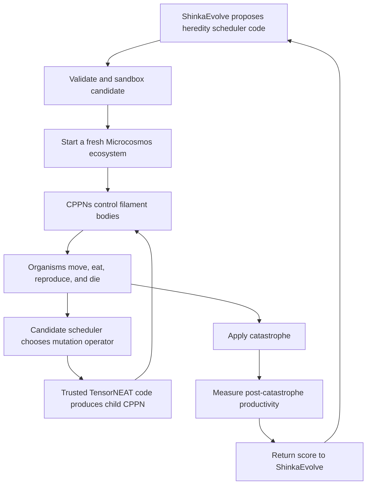

# Evo²-Ecosystem: End-to-End Code Walkthrough

This document explains the Evo²-Ecosystem implementation from three perspectives:

1. **High level:** what the complete system does.
2. **Why level:** why the architecture is organized this way.
3. **Code level:** where each part is implemented and how data moves through it.

## The system in one paragraph

Evo²-Ecosystem contains three nested processes. Microcosmos simulates physical filament organisms moving through a resource-limited world. Those organisms reproduce, so their inherited TensorNEAT CPPN controllers evolve through ecological selection. Outside that ecosystem, ShinkaEvolve improves the small heredity scheduler that decides how a parent's CPPN should be mutated when producing a child. Microcosmos physics, resource rules, catastrophes, and scoring remain fixed.



The crucial distinction is:

- TensorNEAT changes organism controllers.
- Ecological competition selects which organisms reproduce.
- ShinkaEvolve changes how TensorNEAT mutation is deployed.
- Microcosmos physics, resources, catastrophes, and scoring remain fixed.

## 1. The three kinds of generation

The word *generation* appears at three levels:

| Level | What advances | Meaning |
|---|---|---|
| Physics step | Fluid, bodies, resources, and energy | One moment in the ecosystem |
| Biological generation | A parent produces a child | One organism generation |
| Shinka generation | A heredity-policy program produces program descendants | One outer RSI generation |

The outer loop does not directly create biological generations. It proposes a heredity policy and watches many biological generations occur inside a complete ecosystem evaluation.

That separation is what makes the project an improvement of an improvement process.

## 2. What starts the RSI loop

The outer entry point is [`run_evo.py`](../ShinkaEvolve/examples/evo2_ecosystem/run_evo.py).

Conceptually, one arm is launched at a time:

```bash
python run_evo.py --regime stable
python run_evo.py --regime punctuated
```

In this project, Python commands must be run through the `sakana` Conda environment. The actual invocation should therefore use `conda run -n sakana` from the appropriate repository directory.

The runner:

1. Checks that the experiment specification and source files have not changed.
2. Verifies that hidden evaluation material remains locked.
3. Creates or resumes the Shinka archive.
4. Configures the candidate evaluator.
5. Starts ShinkaEvolve.
6. Stops after the configured number of outer generations.
7. Writes a completion marker.

The experiment is not indefinite. Its immutable budget lives in [`run_spec.json`](../ShinkaEvolve/examples/evo2_ecosystem/run_spec.json), which currently specifies 15 Shinka generations per arm.

This bounded termination is scientifically important: stable-trained and catastrophe-trained Shinka receive the same search budget.

## 3. Why there are two outer runs

There are two separate ShinkaEvolve arms:

- **Stable:** ecosystems encounter matched null events.
- **Punctuated:** ecosystems encounter resource relocations or population bottlenecks.

The rest of the implementation remains the same.

The research question is not merely whether Shinka can find a good mutation scheduler. It is whether training under catastrophes causes Shinka to discover a different and more robust heredity scheduler than training in stable ecosystems.

The two regimes must not share an archive or exchange candidate programs. Otherwise, the stable and punctuated treatments would no longer be independent. The isolation and run preparation logic is in [`run_evo.py`](../ShinkaEvolve/examples/evo2_ecosystem/run_evo.py).

## 4. What ShinkaEvolve is allowed to write

The initial evolvable program is [`initial.py`](../ShinkaEvolve/examples/evo2_ecosystem/initial.py):

```python
def make_offspring(
    parent_genome,
    parent_stats,
    population_stats,
    rng,
):
    return jnp.array([0.0, 0.0, 0.0, 1.0])
```

The name `make_offspring` is now slightly historical. The function does not construct a complete child genome. It returns four scores:

```text
[
    clone score,
    parametric-mutation score,
    structural-mutation score,
    mixed-mutation score,
]
```

The initial program always assigns the highest score to mixed mutation.

A Shinka descendant could instead implement a policy resembling:

```python
stress = -population_stats[1]
low_diversity = 1.0 - population_stats[2]

return jnp.array([
    stable_condition,
    conservative_condition,
    exploration_condition,
    stress + low_diversity,
])
```

This is deliberately a small decision surface.

### Why Shinka does not directly edit CPPN arrays

Allowing arbitrary generated code to edit graph genomes would create a large failure surface:

- malformed connections;
- invalid node references;
- cyclic graphs;
- broken padding;
- NaNs;
- excessive code complexity;
- manipulation outside the intended mutation logic.

Instead, Shinka decides which evolutionary strategy is appropriate, while trusted TensorNEAT code performs the graph mutation. This gives Shinka meaningful algorithmic freedom without allowing it to rewrite simulator internals.

## 5. How candidate code is secured

Candidate validation happens in [`evaluate.py`](../ShinkaEvolve/examples/evo2_ecosystem/evaluate.py).

Before an ecosystem runs, the evaluator checks that:

- exactly one allowed function exists;
- imports and built-ins are restricted;
- only approved JAX operations are used;
- filesystem, network, subprocess, and reflection access are unavailable;
- source and AST sizes are bounded;
- the output contains four finite numbers;
- eager execution works;
- JAX shape evaluation works;
- JIT compilation works;
- batching with `vmap` works;
- repeated calls are reproducible.

The validated source is compiled from the already-inspected bytes in an empty built-ins environment. This prevents a time-of-check/time-of-use source substitution.

The candidate should improve heredity, not inspect hidden files, identify the scenario, or modify evaluation code.

## 6. What information the policy sees

The adapter in [`evaluate.py`](../ShinkaEvolve/examples/evo2_ecosystem/evaluate.py) gives the candidate small summary arrays rather than complete simulator state.

Parent information contains approximately:

```text
parent genome summary:
- fraction of available CPPN nodes in use
- fraction of available CPPN connections in use

parent statistics:
- energy relative to the reproduction threshold
- recent resource intake
```

Population information contains:

```text
- alive population fraction
- recent population trend
- behavioral/action diversity
- founder-lineage entropy
```

It does not receive:

- the current test name;
- the catastrophe schedule;
- future events;
- the random-seed number;
- hidden evaluation parameters;
- the score implementation;
- direct access to resource or physics arrays.

A candidate may react to ecological stress, but it cannot explicitly know that a bottleneck is about to happen.

## 7. The physical ecosystem state

The central state definitions are in [`population.py`](../microcosmos/src/microcosmos/structs/population.py).

`PopulationState` stores fixed-shape arrays for every possible organism slot:

```python
alive
energy
age
generation
individual_id
parent_id
genome
controller_order
controller_connection_index
founder_lineage_id
intake_ema
population_change_ema
```

`EcosystemState` combines the population with:

```python
nodes
edges
fluid and resource fields
simulation time
base body geometry
resource capacity map
resource regeneration map
```

The default configuration uses 32 organism slots, 8 nodes per organism, and 8 initially living founders.

All 32 slots occupy memory, but only slots with `alive=True` represent living organisms.

### Why fixed slots exist

JAX and GPUs work best when array shapes remain constant. Dynamically appending an organism would change the number of nodes, edges, controller batches, and physics-solver shapes. That would trigger recompilation and complicate batching.

Instead:

```text
death = deactivate a slot
birth = write a child into an inactive slot
```

This gives a dynamically changing population while preserving static GPU array shapes.

## 8. The organism genome is a CPPN

The CPPN representation is in [`cppn.py`](../microcosmos/src/microcosmos/cppn.py).

Each genome has:

```text
4 controller inputs
1 controller output
at most 15 nodes
at most 30 connections
```

The four inputs are:

1. normalized position along the filament;
2. time phase;
3. local resource concentration;
4. head-versus-tail resource difference.

The output is the requested local bending angle.

Each organism therefore carries its own TensorNEAT-compatible CPPN graph. The active ecosystem does not use a temporary Fourier or fixed controller.

## 9. How variable CPPN topology fits fixed GPU arrays

A graph may contain a varying number of nodes and connections, but its storage remains fixed-sized.

`CPPNGenome` in [`cppn.py`](../microcosmos/src/microcosmos/cppn.py) stores padded `node_genes` and `connection_genes` arrays. Unused rows use the safe padding conventions expected by TensorNEAT.

For example:

```text
Organism A: 7 active nodes, 10 connections
Organism B: 12 active nodes, 25 connections

Both occupy storage for:
15 node rows
30 connection rows
```

This permits structural CPPN mutation without dynamic JAX shapes.

## 10. Founder CPPNs

The canonical founder controller is constructed in [`cppn.py`](../microcosmos/src/microcosmos/cppn.py).

It begins with a small valid traveling-wave structure rather than a completely arbitrary graph. The initial population is created from it using small deterministic perturbations.

Completely random CPPNs would make many founders incapable of moving or feeding. Candidate evaluation would then measure immediate extinction rather than meaningful heredity and catastrophe recovery. The founders are therefore viable but not assumed optimal.

## 11. How a CPPN controls a filament

Controller evaluation occurs in [`cppn.py`](../microcosmos/src/microcosmos/cppn.py).

For each organism and each bending hinge, the code constructs:

```python
observation = [
    body_coordinate,
    phase,
    local_resource,
    head_tail_resource_gradient,
]
```

The same organism CPPN is evaluated across every hinge. Its output is checked for numerical validity, passed through a bounded activation, scaled by the maximum bending amplitude, and zeroed if the organism is dead.

This produces coordinated whole-body behavior because one compact network is reused along the body.

## 12. Why controller execution is cached

A graph network needs a valid topological evaluation order. TensorNEAT computes that order from its connections.

The topology changes only when the ecosystem initializes or a child is created through structural mutation. The code therefore caches `controller_order` and `controller_connection_index` in the population state.

The simulator does not rediscover graph order at every physics step. It reuses the cached order until the genome changes, keeping the active physical loop smaller and faster.

## 13. Resetting an ecosystem

The main environment is [`EcosystemEnv`](../microcosmos/src/microcosmos/gym/ecosystem.py), and its reset logic is in the same file.

Reset performs the following:

1. Creates all fixed body slots.
2. Places them in the world.
3. Marks only founder slots alive.
4. Initializes founder CPPN genomes.
5. Computes cached controller execution orders.
6. Assigns organism and founder-lineage identifiers.
7. Initializes energy and age.
8. Creates the finite resource field and regeneration map.
9. Initializes fluid and filament physics.

Every Shinka candidate is evaluated in fresh ecosystems. It does not inherit organisms from the preceding candidate.

## 14. One complete ecosystem step

The physical/ecological step is implemented in [`ecosystem.py`](../microcosmos/src/microcosmos/gym/ecosystem.py).

Its order is roughly:

```text
1. Read the alive mask.
2. Sample resource information for each organism.
3. Construct CPPN observations.
4. Evaluate every living organism's CPPN.
5. Apply bending commands to filament bodies.
6. Advance Microcosmos physics and fluid.
7. Let mouths consume finite resources.
8. Charge basal and actuation energy.
9. Kill organisms that run out of energy.
10. Update ecological summaries.
11. Find parents eligible to reproduce.
12. Invoke the heredity scheduler.
13. Mutate and validate child CPPNs.
14. Write newborns into free slots.
15. Emit compact telemetry.
```

The Gym-compatible reward is resource uptake, but the RSI verifier evaluates complete ecosystem recovery curves rather than optimizing individual step rewards directly.

## 15. Resource competition

Finite-resource handling is in [`ecology.py`](../microcosmos/src/microcosmos/ecology.py).

Each filament's first node acts as its mouth. If several organisms occupy the same resource cell, the code first sums their demands and then divides available stock proportionally:

```python
total_demand = sum(organism_demands_in_cell)
scale = min(1, resource_available / total_demand)
actual_uptake_i = demand_i * scale
```

This prevents multiple organisms from independently consuming the same unit of food.

After consumption, the resource field may diffuse conservatively, regenerate from fixed sources, and remain bounded by a fixed capacity. These rules are immutable during Shinka search.

## 16. Energy and death

Energy accounting is also implemented in [`ecology.py`](../microcosmos/src/microcosmos/ecology.py):

```python
new_energy = (
    old_energy
    + assimilated_resource
    - basal_cost
    - actuation_cost
)
```

Actuation cost depends on controller-output magnitude. An organism dies when its energy reaches zero or its maximum lifespan is reached.

The slot then becomes inactive:

- it generates no controller output;
- it contributes no active body forces;
- it cannot feed;
- it cannot reproduce;
- it becomes available for a child.

The alive mask is the authoritative definition of physical existence.

## 17. Reproduction, step by step

Reproduction is the core of [`ecology.py`](../microcosmos/src/microcosmos/ecology.py).

A parent must be alive, sufficiently mature, above the reproduction threshold, and able to pay the birth cost. At least one inactive organism slot must exist.

For each birth:

1. Create an identity-stable random key from child ID and time.
2. Summarize the parent.
3. Summarize the population.
4. Call the Shinka-written scheduler.
5. Obtain four operator scores.
6. Select the highest-scoring trusted operator.
7. Use TensorNEAT to mutate the parent CPPN.
8. Validate the resulting graph and cached execution order.
9. Fall back safely to cloning if anything is invalid.
10. Debit the parent's energy.
11. Initialize the child's energy.
12. Assign child ID, parent ID, generation, and founder lineage.
13. Put the child genome into the free slot.
14. Spawn its filament body near the parent.

This is genuine parent-child heredity within the simulation.

## 18. The four trusted mutation operators

The mutation layer is in [`heredity.py`](../microcosmos/src/microcosmos/heredity.py).

### Clone

Copy the parent CPPN unchanged. This may be useful when a lineage is performing well and variation would be destructive.

### Parametric mutation

Change continuous controller values such as connection weights and biases while keeping network topology unchanged.

### Structural mutation

Change graph structure through trusted TensorNEAT operations. This provides more exploratory changes.

### Mixed mutation

Combine parametric and structural mutation. The initial policy always chooses this operator.

The selected operator is applied through `jax.lax.switch`, preserving JAX compatibility.

## 19. What selection means here

This is not a complete canonical NEAT population loop.

Canonical NEAT normally includes synchronous generations, explicit global fitness ranking, speciation, crossover, and population-wide replacement.

Evo² uses TensorNEAT for CPPN genome representation, graph inference, parameter mutation, structural mutation, and graph validation. Selection is ecological:

```text
better resource collection
    -> more stored energy
    -> more reproduction opportunities
    -> more descendants
```

Organisms reproduce asynchronously while sharing one world. This better matches a continuous embodied ecosystem than a separate tournament that pauses physics every generation.

## 20. Physically spawning the child

After population arrays are updated, [`ecosystem.py`](../microcosmos/src/microcosmos/gym/ecosystem.py) initializes the child's physical body.

The child is placed near its parent using candidate spawn positions selected to reduce immediate collisions. Its node positions, velocities, rest lengths, rest bending state, and activity masks are reset to newborn values.

The genome is inherited, but the body follows a predefined filament topology. This is reproduction, not self-assembly.

## 21. Chunked GPU execution

Chunk execution is handled in [`rollout.py`](../microcosmos/src/microcosmos/rollout.py).

A chunk runs a fixed number of steps using `jax.lax.scan` and accumulates compact metrics such as:

- resource uptake;
- births and deaths;
- population size;
- energy;
- operator selection counts;
- infrastructure violations.

Chunks avoid storing enormous node trajectories, provide catastrophe boundaries, permit integrity checks, keep JIT shapes fixed, and make finalist snapshots manageable.

The default experiment runs 8,000 physics steps, with the main event at step 4,000 and 500 steps per chunk.

## 22. Catastrophes and matched null events

Events are defined in [`protocol.py`](../microcosmos/experiments/evo2_ecosystem/protocol.py).

Implemented events include:

- null event;
- resource relocation;
- random bottleneck;
- dominant-founder-lineage cull.

For paired evaluation, the ecosystem runs to the event boundary once. The exact same pre-event state then forks into:

```text
branch A: catastrophe
branch B: matched null event
```

This behavior is coordinated in [`episode.py`](../microcosmos/experiments/evo2_ecosystem/episode.py). It eliminates accidental pre-event differences between shocked and unshocked worlds.

## 23. What the score measures

The primary score is implemented in [`protocol.py`](../microcosmos/experiments/evo2_ecosystem/protocol.py).

For every post-event chunk:

```python
normalized_productivity = (
    post_event_resource_uptake
    / pre_event_reference_productivity
)
```

The score is the area under the post-event productivity curve.

In plain language: after the catastrophe, how effectively does the population regain its ability to collect resources?

The score does not directly reward lineage diversity, genetic diversity, mutation magnitude, final population size, or merely remaining alive. Those are logged as diagnostics.

This avoids paying the policy to preserve useless diversity or fill every population slot with organisms that consume little resource.

## 24. Why every manifest runs three times

Complete candidate evaluation is handled in [`episode.py`](../microcosmos/experiments/evo2_ecosystem/episode.py).

The full manifest is executed three times. Even with the same nominal JAX seeds, parallel GPU scatter and reduction operations can produce small numerical differences. In a nonlinear ecosystem, small floating-point differences can eventually alter births and deaths.

The evaluator therefore:

1. runs the complete manifest three times;
2. requires all three runs to pass integrity checks;
3. sorts their aggregate scores;
4. retains the coherent median complete run.

It does not independently choose the best episode from each world. That would construct a result that never occurred as one real execution.

## 25. What returns to ShinkaEvolve

The evaluator returns:

- one scalar combined score;
- aggregate public diagnostics;
- private integrity information;
- textual feedback.

Feedback can explain, for example, that a population remained productive before the event but recovered slowly afterward, or that structural mutation was rarely selected.

Shinka uses the candidate source, its score, its diagnostics, archived parent programs, and program lineage information to propose descendants.

Each generated candidate appears as a `main.py` inside a `gen_N` directory. These files are artifacts produced by the outer loop, not experiment entry points. The archive and parent relationships live in Shinka's SQLite database.

## 26. How Shinka evolution terminates

The outer runner is constructed in [`run_evo.py`](../ShinkaEvolve/examples/evo2_ecosystem/run_evo.py).

Its normal termination condition is:

```python
num_generations = run_spec["generations"]
```

The current budget is 15 generations for the stable arm and 15 for the punctuated arm. The run may stop early because of an external interruption or fatal integrity failure, but it is not designed to run indefinitely.

After successful completion, the runner audits the expected generations and writes a completion marker.

## 27. Baselines

The baseline runner is [`run_baselines.py`](../microcosmos/experiments/evo2_ecosystem/run_baselines.py).

The main implemented baselines are:

- clone;
- fixed parametric mutation;
- fixed mixed mutation;
- hand-written stress-responsive mutation.

They use the same environment, manifests, simulation budget, numerical repeats, scoring, and integrity checks. This isolates the effect of the heredity policy.

## 28. Finalist selection

After both Shinka arms finish, [`freeze_finalist.py`](../ShinkaEvolve/examples/evo2_ecosystem/freeze_finalist.py) performs development-set selection.

For each arm, it:

1. audits that exactly the intended search completed;
2. selects the three strongest distinct training candidates;
3. re-evaluates them on development scenarios;
4. ranks valid candidates by development performance;
5. freezes the winning source file;
6. exports its Shinka code lineage;
7. records source and configuration hashes.

The winner is selected using the development set, not the sealed final test.

## 29. Sealed final evaluation

The final evaluation entry point is [`workflow.py`](../microcosmos/experiments/evo2_sealed/workflow.py).

It evaluates six frozen policies, including the stable-trained Shinka champion, catastrophe-trained Shinka champion, and conventional baselines.

The workflow:

1. verifies every source and configuration hash;
2. verifies that the final manifest was not exposed during search;
3. runs each policy in a fresh guarded process;
4. collects complete raw result vectors;
5. recomputes scores independently;
6. validates repeat and median coherence;
7. produces direct shocked-world contrasts;
8. produces matched shock-versus-null analyses.

The primary comparison is catastrophe-trained Shinka against stable-trained Shinka, fixed mixed mutation, and the hand-written stress response.

## 30. Where the system is differentiable

The continuous physical core remains JAX/GPU native:

- CPPN inference;
- bending control;
- filament physics;
- resource sampling;
- energy calculations;
- batch statistics;
- fixed-shape rollout scans.

The complete ecosystem is not end-to-end differentiable because it contains discrete operations:

- alive/dead masks;
- reproduction thresholds;
- free-slot allocation;
- mutation-operator `argmax`;
- structural graph mutation;
- lineage assignment;
- catastrophe removal.

That is appropriate. The project uses evolutionary program search rather than gradient descent through an entire ecological history. Microcosmos's differentiability remains available for future work, but forcing differentiability across death and topology changes would add complexity without helping this experiment.

## 31. What is recursively improving

The system is not recursively rewriting all of Microcosmos.

The hierarchy is:

```text
Microcosmos physics
    fixed

Ecological selection
    selects organisms through survival and reproduction

TensorNEAT mutation
    changes organism CPPNs

Shinka heredity scheduler
    decides which TensorNEAT mutation operator to use

ShinkaEvolve
    improves that scheduler across outer generations
```

The recursively improved artifact is a component of the inner evolutionary process. The appropriate claim is therefore bounded recursive program improvement: ShinkaEvolve improves an algorithm responsible for generating future evolutionary descendants.

It is not unrestricted self-improving AI.

## 32. Recommended source-reading order

To inspect the implementation without becoming overwhelmed, read it in this order:

1. [`initial.py`](../ShinkaEvolve/examples/evo2_ecosystem/initial.py) — the tiny program Shinka edits.
2. [`heredity.py`](../microcosmos/src/microcosmos/heredity.py) — how scores become CPPN mutations.
3. [`ecology.py`](../microcosmos/src/microcosmos/ecology.py) — resource accounting, energy, death, and reproduction.
4. [`ecosystem.py`](../microcosmos/src/microcosmos/gym/ecosystem.py) — one complete physical/ecological step.
5. [`cppn.py`](../microcosmos/src/microcosmos/cppn.py) — how organism controllers generate movement.
6. [`episode.py`](../microcosmos/experiments/evo2_ecosystem/episode.py) — how a candidate is scientifically evaluated.
7. [`evaluate.py`](../ShinkaEvolve/examples/evo2_ecosystem/evaluate.py) — the Shinka-facing verifier and security boundary.
8. [`run_evo.py`](../ShinkaEvolve/examples/evo2_ecosystem/run_evo.py) — the RSI entry point.
9. [`freeze_finalist.py`](../ShinkaEvolve/examples/evo2_ecosystem/freeze_finalist.py) — development selection and freezing.
10. [`workflow.py`](../microcosmos/experiments/evo2_sealed/workflow.py) — the sealed final examination.

## Final plain-language summary

The code starts a physical ecosystem whose organisms carry inherited CPPNs. Resource competition determines which organisms accumulate enough energy to reproduce. Whenever a child is born, a Shinka-generated scheduler chooses how the parent's CPPN should be mutated, while trusted TensorNEAT code performs and validates that mutation. The ecosystem experiences a controlled event, and the scheduler is scored by how well the population recovers its resource productivity. ShinkaEvolve then uses that score to propose improved scheduler programs, repeating for a fixed 15-generation budget in both stable and catastrophe-trained experimental arms.
