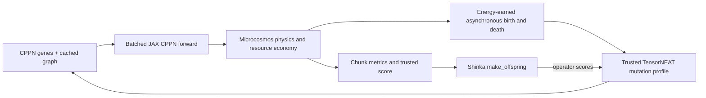

[PRD]
# PRD: Evo²-Ecosystem

- Status: implementation and confirmatory experiment complete; scientific hypothesis not supported
- Revision: 9
- Updated: 2026-07-12
- Repositories: `microcosmos`, `ShinkaEvolve`

## 1. Objective

Extend the completed Microcosmos lifecycle with inherited fixed-capacity CPPN
controllers, then use ShinkaEvolve to search for an ecology-conditioned
scheduler over four trusted TensorNEAT mutation operators.

The inner process is continuous embodied evolution: organisms collect finite
resources, reproduce asynchronously, inherit mutated controllers, and die. The
outer process evolves the executable operator scheduler. It does not rewrite
raw CPPN graphs, TensorNEAT mutation kernels, or a full generational NEAT loop.
The claim is bounded recursive program improvement.

## 2. Scientific question

> Can ShinkaEvolve discover an ecology-conditioned scheduler over four trusted
> TensorNEAT mutation operators that recovers from unseen resource shocks
> better than fixed mixed TensorNEAT mutation and a scheduler trained only in
> stable worlds?

The decisive controlled comparison is:

```text
same CPPN founders + same Shinka budget + same score + paired worlds
                     only outer-training events differ

stable-world Shinka  vs  relocation/bottleneck-trained Shinka
```

The primary conventional anchor is a frozen mixed TensorNEAT mutation profile.
A frozen hand-written stress scheduler is the strongest human baseline.

## 3. Implemented foundation

The lifecycle and embodied-foraging feasibility work is complete:

- fixed-capacity slots and activity-aware fluid, steric, and constraint physics;
- energy-conserving asexual birth, death, same-step reuse, and monotonic IDs;
- localized renewable resources with mouth-only consumption;
- fixed ecological traits, identity-keyed randomness, and body-aware placement;
- compact jitted rollout chunks and opt-in sparse snapshots;
- fluid-on movement and resource-acquisition positive controls;
- a green CPU regression suite and guarded GPU long-rollout evidence.

The current 23-locus traveling-wave controller remains useful as a regression
oracle for physics, sensing, and foraging. It is not the active controller in
this project and is not an implementation stage to calibrate.

TensorNEAT is already pinned by Microcosmos and provides a fixed-shape
`DefaultGenome`, JAX forward execution, feed-forward cycle checks, topology
mutation, value mutation, and compatibility distance.

The direct CPPN/heredity path, one-time viable-turnover calibration, event
protocol, compact evaluator, canonical partition manifests, bounded Shinka
task, evaluator process-tree timeout hardening, matched searches, development
selection, and frozen final comparison are complete. Ordinary GPU
reduction-order variation is a recorded limitation. Every policy/manifest
evaluation therefore consists of
exactly three full-manifest GPU measurements; one coherent median-scoring
execution is selected with stable tie breaking, and integrity must pass in all
three. These are nested numerical measurements, not ecological replicates.

## 4. Core design decision

Embed CPPN controllers and NEAT-compatible mutation directly in the continuous
ecosystem. Do not embed TensorNEAT's full `NEAT.ask/tell` population loop.

Microcosmos already supplies selection:

```text
resource collection -> stored energy -> asynchronous birth -> starvation/death
```

Full NEAT would add synchronous generations, whole-population replacement,
fitness selection, speciation, elitism, and crossover. That would duplicate
selection, break persistent embodied lineages, and make the result
uninterpretable.

The accurate description is:

> CPPN-controlled organisms undergo asynchronous ecological selection while
> ShinkaEvolve searches for an ecology-conditioned scheduler over clone,
> parametric, structural, and mixed trusted TensorNEAT mutation operators.

Do not claim that Evo² runs or improves full generational NEAT.

## 5. Scope

### In scope

- 32 fixed organism slots, 8 nodes per predefined line body, and exactly 8
  founders selected by the frozen calibration. All confirmatory results are
  conditional on this one founder panel.
- One feed-forward CPPN controller per slot in fixed padded arrays.
- Four fixed controller inputs and one bounded bending output.
- Parametric, activation, and add/delete node/connection mutation through
  trusted TensorNEAT profiles.
- Finite resources, metabolism, movement cost, birth, death, lineage, and
  several generations.
- One experiment-side event at a rollout-chunk boundary.
- Visible training events: resource relocation and a fitness-independent
  random bottleneck.
- Sealed events: unseen resource geometry/timing/abundance and a capped
  dominant-founder-lineage cull.
- One marker-bounded four-argument `make_offspring` function.
- Matched stable and punctuated Shinka searches, conventional baselines, and
  sealed paired evaluation. Exact ancestor–descendant common gardens and one
  mechanism ablation are finalist-only when a positive result supports them.
- One 15-generation outer run per treatment, top-three development selection,
  and a selected-policy comparison rather than a population-level claim about
  the general superiority of either outer-training procedure.

### Explicit non-goals

- a runtime choice between wave and CPPN controllers;
- full NEAT selection, synchronous generations, speciation, elitism, or
  crossover;
- sexual reproduction, self-assembly, arbitrary bodies, evolved segment
  lengths, recurrent CPPNs, predators, or evolved metabolism;
- arbitrary Shinka edits to graph arrays or mutation implementations;
- a custom parallel graph-mutator, controller plugin framework, second
  simulator, or core scenario engine;
- end-to-end differentiation through birth, death, catastrophe, or topology
  changes;
- viscosity, actuator injury, or body-length transfer before the core result.

## 6. Minimal architecture

Add exactly two reusable modules:

```text
microcosmos/src/microcosmos/cppn.py
microcosmos/src/microcosmos/heredity.py
```

Responsibilities:

- `cppn.py`: frozen TensorNEAT definition, canonical founder, input
  construction, cached transform, batched forward pass, bounds, and graph
  validation.
- `heredity.py`: normalized stats, opaque mutation context, four trusted
  operator profiles, `mutate_cppn`, and conventional policies.
- existing Microcosmos modules: state storage, lifecycle invocation, action
  application, resource economy, and compact telemetry.
- `experiments/evo2_ecosystem`: manifests, chunk-boundary events, scoring,
  baseline execution, finalist traces, and plots.
- ShinkaEvolve: code proposal, archive, and search orchestration only.



There is one ecosystem execution path. The archived wave controller is invoked
only by its focused regression tests.

## 7. Frozen CPPN contract

### 7.1 Representation

Use TensorNEAT `DefaultGenome` and `DefaultConn`:

```python
CPPNGenome(
    node_genes,        # float32 [capacity, 15, 5]
    connection_genes,  # float32 [capacity, 30, 3]
)
```

Node rows are `[key, bias, response, aggregation, activation]`. Connection rows
are `[input_key, output_key, weight]`. Unused rows are all NaN, as required by
TensorNEAT. No innovation-marker state is added because v1 has neither
crossover nor speciation; endpoint-aligned graph distance is sufficient for
diagnostics.

Every inactive slot retains a valid CPPN because fixed-capacity `vmap` evaluates
every slot. Reset-time inactive slots are canonical; a dead slot may retain its
last organism's valid genes/cache until birth overwrites it. The alive mask
makes its command zero.

### 7.2 Network

Freeze:

- 4 inputs;
- 1 output;
- at most 15 nodes and 30 connections;
- feed-forward topology;
- sum aggregation only;
- activation palette: identity, sine, tanh, and absolute value;
- no output activation inside TensorNEAT;
- one external output transform:
  `max_bending_delta * tanh(raw_output)`.

Inputs, in order:

1. normalized bending-hinge coordinate along the body;
2. physical-time phase at a frozen 5.0 radians per simulation-time unit;
3. normalized local resource;
4. normalized head-minus-tail resource difference.

The controller cannot change body topology, rest length, resource rules, or
ecological traits.

### 7.3 Founder family

Hand-construct one canonical valid graph with:

- the four input nodes;
- one sine hidden node receiving coordinate and phase;
- one output node;
- a traveling-wave path through the sine node;
- small direct resource connections for steering.

Generate founder standing variation by small, safe value perturbations only.
Do not use random TensorNEAT initialization, checkpoints, or archive loading.
All policies receive the identical founder panel.

Required bridge controls:

- canonical CPPN produces a traveling wave and measurable fluid-on motion;
- zero-output CPPN has no controller-driven drift;
- sensor-enabled founder outperforms a weight-matched sensor-disabled control
  in paired resource acquisition.

## 8. Population state and caching

Replace the flat array genome with:

```python
@dataclass
class CPPNGenome:
    node_genes: jax.Array
    connection_genes: jax.Array


@dataclass
class PopulationState:
    ...
    genome: CPPNGenome
    controller_order: jax.Array             # int32 [capacity, 15]
    controller_connection_index: jax.Array  # int32 [capacity, 15, 15]
    founder_lineage_id: jax.Array            # int32 [capacity]
    intake_ema: jax.Array                    # float32 [capacity]
    population_change_ema: jax.Array         # float32 scalar
```

TensorNEAT `transform` runs only when founders are initialized or a child is
created. The cached order/index arrays are derived trusted state, never exposed
to Shinka, inherited, or mutated.

At reproduction:

1. rank parents and free slots exactly as today;
2. derive child IDs and identity-keyed mutation contexts;
3. enter one `lax.cond(birth_count > 0, ...)` branch;
4. execute only actual ranked births with
   `lax.fori_loop(0, birth_count, ...)`; a vmapped switch would execute every
   mutation branch;
5. clone and flag candidate-invalid scores; validate trusted mutation output,
   using parent fallback plus an infrastructure-failure flag for an invalid
   graph;
6. transform valid children once;
7. scatter both immutable gene leaves and caches directly;
8. spawn bodies through the existing placement path.

Either fallback still completes the scheduled clone birth with normal parent
energy debit, child endowment, new identity, and inherited lineage. Candidate
invalidity makes evaluation incorrect; trusted graph invalidity is an
infrastructure failure.

A frozen `DYNAMIC_NODE_KEY_OFFSET = 1024` supplies
`new_node_key = DYNAMIC_NODE_KEY_OFFSET + child_id`. Assert this value is below
`2**24` so TensorNEAT's float32 gene storage represents it exactly.
`DefaultConn` does not consume connection innovation markers, but TensorNEAT
still requires a `new_conn_key` array of shape `(3,)`; pass frozen float32
zeros.

## 9. Evolvable boundary

The only editable function returns four scores over trusted mutation profiles:

```python
def make_offspring(
    parent_genome,     # [node_fraction, connection_fraction], not raw genes
    parent_stats,      # [energy_fraction, intake_ema]
    population_stats, # [alive_fraction, change, diversity, lineage_entropy]
    rng,               # opaque reserved argument; reading it is rejected
):
    return jnp.array([clone, parametric, structural, mixed], dtype=jnp.float32)
```

The historical first-argument name is retained for the task ABI, but the
candidate receives only normalized complexity summaries. It cannot inspect,
index, construct, or modify CPPN genes or the trusted mutation context. A
trusted adapter calls `mutate_cppn(parent_genome, scores, mutation_context)`
after the candidate returns. Mutation randomness and node-key allocation never
cross the candidate boundary.

Trusted `mutate_cppn` validates four scores, selects their deterministic
`argmax`, and returns a child outcome with policy-validity and operator
metadata. Nonfinite scores return an immediate clone with
`policy_valid=false`; they never execute mutation:

1. `CLONE` — exact parent.
2. `PARAMETRIC` — TensorNEAT weights, biases, responses, and activations;
   structural rates zero.
3. `STRUCTURAL` — TensorNEAT add/delete node/connection; value and activation
   rates zero.
4. `MIXED` — the frozen conventional TensorNEAT value plus structural profile.

After any non-clone mutation, trusted code resets nonfunctional input-node
attributes and the ignored output activation to canonical values before graph
validation. This prevents neutral drift from wasting mutation or inflating
distance diagnostics.

The TensorNEAT profile constants and compatibility adjustments are frozen. The
same trusted implementation serves every baseline and candidate.

Visible statistics:

```python
ParentStats(
    energy_fraction,
    intake_ema,
    node_fraction,
    connection_fraction,
)

PopulationStats(
    alive_fraction,
    population_change_ema,
    action_diversity,
    lineage_entropy,
)
```

Do not expose time, event/scenario identity, future catastrophe timing, raw
IDs, raw simulator state, hidden seeds, or scores.

## 10. Trusted invariants

Candidates cannot change:

- CPPN shape, inputs, activations, output transform, or mutation profiles;
- physics, timestep, solver, grid, viscosity, body, or capacity;
- resource, uptake, metabolism, birth, death, lifespan, and placement rules;
- parent ranking, free-slot allocation, energy debit, identity, or lineage;
- event manifests, transforms, RNG derivation, horizon, or seeds;
- score, validity, timeout, and compute budgets.

Graph validation requires:

- exact shapes/dtypes;
- each gene row either fully populated or fully NaN;
- finite active attributes and no infinities or partial-NaN rows;
- input keys 0–3 fixed at rows 0–3 and output key 5 fixed at row 5, matching
  TensorNEAT's positional forward ABI;
- valid unique node keys and connection endpoints;
- integer-valued key, aggregation, and activation fields;
- sum aggregation and valid activation indices;
- no duplicate connections or feed-forward cycles;
- finite bounded output after `nan_to_num` containment and external tanh.

Run full endpoint/duplicate/cycle/cache validation at environment construction
for the deterministic founder panel and at newborn creation. The per-step
checker performs cheap complete-row NaN/numeric checks
and carries the trusted infrastructure-valid flag; intentional CPPN padding is
legal, but every physics/ecology leaf remains strictly finite.

## 11. Functional requirements

- FR-1: `EcosystemEnv` uses CPPNs directly with no runtime controller switch.
- FR-2: cached and freshly transformed CPPN outputs agree within tolerance.
- FR-3: founders move and sense resources; inactive controllers command zero.
- FR-4: births inherit and vary CPPNs, update the cache once, and preserve
  energy, identity, and lineage invariants.
- FR-5: clone, parametric, structural, and mixed profiles are deterministic for
  a fixed context and keep valid padded graphs.
- FR-6: one frozen ecology sustains births, natural deaths, and at least three
  generations on the final CPPN path.
- FR-7: relocation and bottleneck events occur between rollout chunks; stable
  episodes receive a null event at the same boundary.
- FR-8: stable and catastrophe Shinka searches differ only in event manifests.
- FR-9: selected sources and all manifests are hashed before sealed evaluation.
- FR-10: finalist mode can reconstruct exact shock-time ancestor/descendant
  pairs without retaining dense fluid histories.
- FR-11: shock/null worlds sharing `pair_id`, seed, and event boundary inside a
  development or sealed manifest reuse one exact pre-event state and fork only
  at the event. Separate policy and outer-arm executions are not claimed to
  share an exact GPU trajectory.

## 12. Non-functional requirements

- NFR-1: arrays remain fixed-shape, JIT-compatible, and GPU-native.
- NFR-2: every candidate sees the same eight independent training worlds and
  its complete manifest is measured exactly three times. The coherent median
  execution supplies the score and episode vectors, all three must pass
  integrity, and numerical repeats never enter the ecological sample size.
- NFR-3: cached CPPN rollout overhead stays within the frozen performance gate.
- NFR-4: one evaluator fits the 24 GiB guard and fixed timeout.
- NFR-5: the full Microcosmos suite stays CPU-green at every phase boundary.
- NFR-6: search rollouts store compact metrics only.
- NFR-7: candidate feedback contains no sealed values or fine-grained shortcut.
- NFR-8: source/config/manifest hashes and device/software metadata accompany
  every result.

## 13. Direct implementation sequence

The stories below create one final architecture. They are review boundaries,
not temporary system variants.

### Phase A — install the final CPPN and heredity path — complete

Implement `cppn.py` and `heredity.py`, migrate `PopulationState`, wire direct
batched inference, move reproduction to the final four-argument policy, update
legal-padding validation, add founder lineage and ecological EMAs, and add
founder/sensor/mutation/birth controls.

Gate:

- all CPPN, lifecycle, cache, JIT/vmap, padding, and RNG tests pass;
- the full CPU suite passes;
- a guarded 1,000-step mutated-child rollout stays finite;
- integrated 32 × 8 CPPN warm rollout time is at most 1.75× the frozen wave
  regression at 64 × 64;
- a warm 32-child mutation batch is at most 5 ms and first compile at most
  15 s under the standard guard.

If the gate fails, optimize caching/vectorization or reduce CPPN capacity once
and remeasure. Do not add a wave/CPPN runtime abstraction.

### Phase B — calibrate sustained turnover once — complete

Calibrate only resource, metabolic, and lifecycle constants using the final
canonical CPPN founders and fixed mixed profile. Freeze the first configuration
that yields births, natural deaths, nontrivial survival, and at least three
generations across the declared panel.

Do not tune ecology separately for policies. If no viable ecology exists in the
timebox, stop before Shinka rather than weaken invariants or add free energy.

Selected `v2_c00_balanced` with ecology SHA-256
`ceab22348b95db80ec8141628e9f7740a8753cf0448573d0a09bfe5eb072ee4d`.
The first panel failed and is retained as evidence; the documented v2 panel
passed without changing controller, physics, seeds, horizon, or gate.

### Phase C — build the experiment evaluator — complete

Add chunk-boundary relocation/bottleneck/cull transforms, canonical manifests,
compact absolute-productivity scoring, paired nulls, and baseline execution.
Lineage/stat state is already part of Phase A; detailed birth-edge traces remain
strictly finalist-only and do not block search.

Gate: hand fixtures match exactly; events cause measurable disruption; clone,
parametric, mixed, and hand-scheduled policies produce non-identical outcomes.
The evaluator, fixtures, and final three-measurement evidence pass. In the
punctuated panel, clone, parametric, mixed, and stress-responsive policies scored
0.1462, 0.1614, 0.0851, and 0.2189 respectively. Fixed mixed fell from 0.1965
in stable worlds to 0.0851 under shocks, a 56.7% drop. Phase C is closed.

### Phase D — integrate ShinkaEvolve — implementation and security gate complete

The marker-bounded task, strict AST validator, eager/JIT/vmap dynamic preflight,
single evaluator, launcher, training-only routing, and process-tree timeout are
implemented. The initial full-horizon GPU candidate passed integrity; a 2–3
generation archive smoke also produced valid descendants and an improving
archive. Its disposable artifacts are not production evidence; both matched
production searches subsequently completed.

Gate: candidates cannot inspect graphs/context or change immutable code;
invalid canaries are rejected; compile plus evaluation fits within 80% of the
timeout; program lineage and result hashes are complete.

### Phase E — search, freeze, and evaluate — complete

Run conventional baselines, one 15-generation outer search per treatment,
top-three development reevaluation, deterministic champion selection, complete
freeze records, and one noninteractive six-policy sealed evaluation. The
selection rule is `development_score_desc_then_generation_asc`. Common gardens
and one minimal mechanism ablation are conditional finalist analyses, not gates
for reporting a valid null result. Do not alter metrics, selection rules, or
plots after opening sealed worlds.

Run the two searches sequentially to avoid GPU-contention drift. After the first
arm writes its authenticated completion marker, make its result directory mode
`000` before starting the second read-only proposer; restore it only after both
archives close.

Execution status: both 15-generation arms completed under run-spec SHA-256
`47ac4c3261a64ec37d04f1303b52846329eeffc6efd92f0bf52276adb4ed304f`.
The stable generation-3 policy and punctuated generation-8 policy won their
respective top-three development selections. All six sealed policies completed
72 worlds in triplicate. Punctuated-minus-stable shocked-world AUC was
`-0.00399` with 95% interval `[-0.01468, 0.00581]`; comparisons with fixed mixed
and stress-responsive mutation also crossed zero. The hypothesis was not
supported. Conditional common gardens and mechanism ablations were therefore
not run. Full results are in `plans/evo2-final-report.md`.

Both development and sealed manifests remained mode `000` throughout both outer
searches. Development was unlocked only after both archives closed. Sealed was
kept unreadable until candidate sources, archive lineage, actual budgets,
analysis, bootstrap settings, preregistration, trusted-source hashes, and both
freeze records were final and verified, then opened once for the fixed run-all
driver. Policies were not inspected between its six fresh guarded processes.

## 14. Required comparisons

Core final table:

1. clone/no mutation;
2. fixed parametric TensorNEAT mutation;
3. fixed mixed TensorNEAT mutation — primary conventional anchor;
4. frozen hand-written stress-responsive operator scheduler;
5. selected stable-world Shinka scheduler;
6. selected catastrophe-world Shinka scheduler.

Structural-only is a mechanism ablation, not a primary baseline. Self-adaptive
Gaussian, Student-t vector noise, wave-module mutation, and a seventh proposal
control are excluded because they require unnecessary parallel machinery or do
not belong to the final six-policy confirmatory comparison.

## 15. Score and analysis

Primary episode score:

```text
gross_productivity = chunk_reward / (chunk_steps * dt)
q = clip(gross_productivity / max(sum(post_event_regeneration_map), eps), 0, 1)
episode_score = mean(q over frozen post-event chunks)
```

Do not put population, survival, diversity, mutation frequency, topology
complexity, recovery time, or code length into the score. Report them as
diagnostics.

Confirmatory primary comparisons use direct normalized post-event AUC in the
shocked worlds:

- catastrophe-trained versus stable-trained Shinka;
- catastrophe-trained Shinka versus fixed mixed TensorNEAT mutation.

Shock-minus-null deficit, resistance, recovery time, and
difference-in-differences are secondary. Use paired ecological world effects
from the selected coherent execution and bootstrap intervals; never bootstrap
the three numerical measurements. Exact
ancestor–descendant common gardens demonstrate heritable performance change;
reciprocal pre/post resource gardens are required for the stronger adaptation
claim.

## 16. GPU-native and differentiability statement

CPPN inference, physical dynamics, resource updates, lifecycle masks, trusted
mutation profiles, and bounded fixed-capacity birth loops are JAX and
accelerator native. NaN padding allows topology changes without changing
shapes.

Structural mutation, profile choice, birth, death, and catastrophes are
discrete. CPPN forward computation and the Microcosmos mechanical kernel remain
differentiable between those transitions, but nearest-cell resource lookup,
allocation/clipping, and alive masks make the ecological objective
non-differentiable even at fixed topology. This project deliberately uses
evolution rather than gradient training. Preserve differentiable mechanics; do
not distort the lifecycle to claim fully differentiable ecology.

## 17. Verification commands

Use the `sakana` Conda environment for every command.

After each core story:

```bash
conda run -n sakana ruff check <touched paths>
conda run -n sakana env JAX_PLATFORMS=cpu pytest <focused tests> -q
```

At every Microcosmos phase boundary:

```bash
conda run -n sakana env JAX_PLATFORMS=cpu pytest -q
```

Focused GPU work runs only after the required preflight:

```bash
systemd-run --user --scope --quiet \
  -p MemoryHigh=20G -p MemoryMax=24G -p MemorySwapMax=2G \
  conda run -n sakana <focused command>
```

Never run the full suite on GPU or raise memory limits without approval.

## 18. Success criteria

Minimum technical success:

- CPPN-controlled birth, structural heredity, death, lineages, and finite
  resources remain valid for several generations under the frozen numerical
  measurement protocol;
- events, score, validator, and Shinka evolution work;
- one evolved scheduler beats fixed mixed mutation on unseen seeds.

Strong scientific result:

- catastrophe-trained scheduler beats stable-trained, fixed mixed, and
  hand-written schedulers on sealed resource changes;
- post-shock descendants outperform exact ancestors in the post-shock garden;
- realized operator choice changes with ecological statistics, and that
  state-dependent mechanism loses its advantage under a one-factor ablation.

If those mechanism tests pass, the defensible final claim is:

> ShinkaEvolve discovered an ecology-conditioned scheduler over four trusted
> TensorNEAT mutation operators that improved recovery of an embodied evolving
> population under unseen resource shocks.

If the champion always selects one profile, use the narrower claim:

> ShinkaEvolve selected a scheduler over four trusted TensorNEAT mutation
> operators that improved recovery on the sealed evaluation.

## 19. Risks and stop conditions

Stop rather than silently amend if:

- valid CPPNs cannot meet the performance/memory gate;
- canonical CPPNs cannot sustain calibratable turnover;
- candidate code can inspect or construct controller genes or mutation context;
- stable/catastrophe configs differ outside event manifests;
- candidate-policy execution is nondeterministic beyond documented GPU
  ecological reduction-order variance, or hidden scenarios leak;
- final results motivate changing metrics or champion selection.

The four-profile portfolio constrains discovery. Report this as a limitation:
the result concerns adaptive scheduling of trusted NEAT-compatible variation,
not arbitrary mutation-algorithm synthesis.

The fixed eight-founder panel and one outer run per treatment impose two
additional limits: the result does not establish transfer across founder
distributions or general superiority of catastrophe-trained search. Report the
two selected schedulers as a case study unless independent outer runs are added
in a separately preregistered experiment.

TensorNEAT reports GPL-3.0 licensing. Before public distribution, verify and
document the combined repository's licensing obligations; this is a release
check, not a reason to duplicate TensorNEAT code.

[/PRD]
