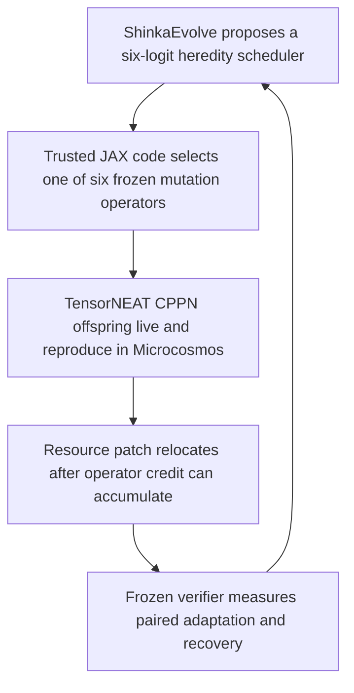

[PRD]
# PRD: Evo² R6 — Credit-Adaptive Heredity Under Resource Relocation

## Post-world, pre-founder operational amendment 2: configured founder timing

Date: 2026-07-14

The first frozen launch completed world qualification, then stopped before
generating or evaluating any R6 founder candidate. The generic configured-R4
founder runner rejected the preregistered `7,500`-step R6 founder horizon
because its execution validator allowed prospective callers to bind new world
seeds and a selection-rule identifier, but not a horizon. A field-by-field
comparison confirmed that the horizon was the sole mismatch with the reused R4
execution shape (`4,000` versus the R6 value frozen below).

The generic validator now treats `horizon` like seeds: a value frozen by the
typed caller contract, while continuing to require the unchanged simulator
configuration, `500`-step chunks, candidate ranges, viability gates, GPU
backend, and all other R4 execution fields. This does not change the R6
founder-screen horizon, candidate bytes, worlds, selection rule, gates, score,
or any downstream budget. The already published world-qualification artifact
is retained byte-for-byte. The correction is committed and a new source freeze
is established before founder generation resumes.

## Pre-data operational amendment 1: evaluator timeout

Date: 2026-07-14

This amendment was made after both source repositories were initially frozen
but before any world seed in `[12,000, 16,000)` or R6 founder candidate was
accessed. A guarded full-cardinality preflight used only retired R5 training
founders and retired world seeds `9000` and `9004`. One numerical repeat took
approximately `276.2` seconds, and the exact three-repeat workload reached the
frozen `10`-minute wall-clock limit before completion while using only about
`3.6 GiB` of memory.

The `10`-minute evaluation timeout in this document is therefore superseded by
`20` minutes for R6 only. This is an operational allowance, not an increase in
scientific compute: all simulator steps, worlds, founders, numerical repeats,
proposal slots, retry rules, model settings, scores, and selection rules remain
unchanged. Stable Shinka, punctuated Shinka, structured random, development,
and sealed policy workers receive the same timeout. R5 remains unchanged.

The Phase 4 mechanical preflight must complete within the amended `20`-minute
limit and the original `24 GiB` cgroup limit before any fresh R6 biological
input may be accessed. This amendment and the code that enforces it must be
committed, pushed, and checked out into the detached launch worktrees first.

## 1. Overview

Evo² R6 is a new, prospectively frozen experiment. It is not a repair,
continuation, or reinterpretation of R5.

R6 keeps the existing GPU-native Microcosmos ecosystem, TensorNEAT CPPN
controllers, six trusted heredity operators, online operator-credit state, and
bounded ShinkaEvolve candidate interface. It changes only the experimental
challenge and the amount of healthy pre-shock time:

- the invalid R5 actuation-cost disturbance is retired;
- one already-supported resource relocation, paired against a same-location
  stock-refresh control, becomes the sole punctuated disturbance;
- the event occurs after one complete maximum lifespan plus two operator-credit
  timescales;
- viability is checked on the exact fixed-standard ancestor rather than by the
  logically invalid R5 clone-versus-standard selector;
- all world seeds and TensorNEAT founders are fresh and partitioned before any
  R6 outcome is observed.

The central question is:

> Can ShinkaEvolve discover a context-dependent heredity scheduler that uses
> online ecological and operator-credit information to improve adaptation and
> recovery after resource relocation on fresh sealed worlds and founders,
> compared with its exact fixed-standard ancestor under matched compute?

The recursive-improvement target remains precise and bounded. Organisms improve
through birth, death, selection, and inherited CPPN variation. ShinkaEvolve
improves the program that chooses how future offspring are varied. Physics,
ecology, trusted mutation implementations, scoring, budgets, and hidden tests
remain outside candidate control.



## 2. Problem Statement

R5 correctly stopped before Shinka search. Its world and founder gates passed,
but none of the preregistered actuation-cost multipliers produced a qualifying
adaptive challenge:

- multipliers `1.25`, `1.50`, `2.00`, and `3.00` all failed the clone-harm gate;
- the observed shock-minus-sham means were approximately `-0.013`, `+0.005`,
  `+0.009`, and `+0.037`;
- uniform exploration produced only `13` resolved pre-event offspring outcomes,
  below the frozen threshold of `24`;
- the viability calculation selected clone by survival and birth count, then
  required the selected clone to produce a genetically distinct child, which a
  clone policy cannot do by definition.

These are benchmark-feasibility failures, not evidence that ShinkaEvolve or the
six-operator scheduler failed. No R5 outer search ran, and no useful R5 Shinka
descendant exists.

R6 must therefore create a genuinely harmful but survivable adaptive problem
and allow sufficient natural pre-event heredity feedback. It must do this
without adding scenario-specific simulator patches, new candidate powers, new
mutation operators, relaxed evidence thresholds, or a compound catastrophe.

## 3. Outcome Hypothesis

If a fresh TensorNEAT population experiences relocation of its finite resource
patch after enough natural births have resolved into operator credit, then the
observable state available to the existing six-logit scheduler should contain a
real, causal scheduling opportunity. A matched control refreshes stock at the
original location, so the contrast isolates patch location rather than the
event implementation's stock reset.

Under that condition, ShinkaEvolve may discover a heredity program that changes
which trusted mutation operators it favors before and after relocation. A
successful punctuated descendant should then outperform its exact
fixed-standard ancestor on fresh sealed founders and worlds while remaining
non-inferior in matched sham worlds.

The claim is deliberately conditional and bounded:

> On the frozen R6 resource-relocation benchmark, autonomous program evolution
> improved the offspring-variation scheduler used by an embodied evolutionary
> population.

R6 does not claim unrestricted self-improvement, open-ended evolution, a
general-purpose evolutionary law, abiogenesis, or transfer to arbitrary
ecological catastrophes.

## 4. Goals

- Qualify a fresh world distribution and fresh `4/4/8` TensorNEAT founder bank
  without reading development or sealed biological outcomes.
- Demonstrate prospectively that the fixed resource relocation is harmful to
  clone populations yet survivable and reproductively viable for the exact
  fixed-standard ancestor.
- Demonstrate at least `24` naturally resolved heredity outcomes both before
  and after relocation, with usable evidence for at least two non-clone
  operators in both periods.
- Demonstrate, before Shinka search, a cross-fitted causal action-choice
  opportunity for a context-dependent scheduler over the six trusted operators.
- Run matched stable and punctuated ShinkaEvolve searches with exactly `50`
  noninitial proposal slots per arm, plus a `50`-candidate structured-random
  control.
- Select exactly one noninitial punctuated confirmatory primary on development
  data before any sealed access.
- Test the frozen primary once on sealed resource-relocation and sham pairs.
- Preserve a complete, hash-bound lineage of source, candidates, gates,
  manifests, selection records, sealed results, and terminal conclusions.
- Keep the implementation experiment-local and make no change to
  `src/microcosmos`.

## 5. Scope Boundaries

### In Scope

- One new protocol revision:
  `evo2-r6-resource-relocation-v1`.
- One new run ID:
  `evo2-r6-resource-relocation-20260714`.
- Fresh reset-only world qualification over preassigned seed ranges.
- A fresh CPU-canonical TensorNEAT founder panel and GPU viability screen.
- One fixed resource-relocation contrast using the existing
  `EventKind.RESOURCE_RELOCATION` implementation for both the original-location
  refresh control and the antipodal relocation.
- A late, lifecycle-derived event schedule with a fixed `12,000`-step horizon.
- Correct R6-only fixed-standard viability logic.
- Existing six-operator natural-feedback and causal-opportunity gates.
- Existing bounded candidate ABI: `29` readable scalar values and `6` output
  logits.
- Existing stable/punctuated Shinka search, fixed baselines, structured-random
  control, development selection, sealed inference, lineage analysis, and
  conditional mechanism ablations.
- A resource-relocation common garden built from the existing R5 common-garden
  machinery with the resource center changed in configuration, not with a new
  simulator.
- Small compatibility-preserving generalization of R5 post-profile workflow
  entry points and Shinka run-spec/sealed-suite dispatch.

### Non-Goals

- No retry, amendment, or reinterpretation of R5.
- No reuse of R5 training, development, or sealed worlds or founder genomes as
  R6 experimental panels.
- No actuation-cost multiplier, actuator injury, random bottleneck,
  dominant-lineage cull, scarcity shock, or compound catastrophe in R6.
- No disturbance-severity grid and no first-passing outcome-selected shock.
- No new resource type, sensor, controller input, CPPN node type, mutation
  operator, candidate input, candidate output, score term, ecology parameter,
  or lifecycle rule.
- No fixed-vector controller intermediate; R6 starts directly with the current
  TensorNEAT CPPN ecosystem.
- No CPPN-NEAT topology search inside the outer loop; organism CPPN genomes
  continue to change only through the six trusted heredity operators.
- No true self-assembly, sexual reproduction, predators, dynamic topology,
  variable population capacity, or learned world model.
- No adversarial environment generator, DGM-style unrestricted rewriting, or
  autonomous modification of the verifier.
- No new Python dependency or GPU memory manager.
- No attempt to make R6 infrastructure generally upstreamable during the
  experiment. Any later upstream extraction is a separate review.

## 6. Research Snapshot

Date: 2026-07-14

- Source: [ShinkaEvolve official overview](https://sakana.ai/shinka-evolve/)
- Key finding: ShinkaEvolve evolves executable programs through an archive of
  evaluated descendants and is intended for sample-efficient algorithm
  discovery. R6 therefore keeps a small executable candidate boundary and an
  objective verifier rather than allowing broad simulator rewriting.
- Source: [ShinkaEvolve repository](https://github.com/SakanaAI/ShinkaEvolve)
- Key finding: the existing Evo² integration already supplies source binding,
  candidate validation, matched archives, and reproducible evaluation. R6
  should extend its strict run-spec routing instead of constructing another
  program-evolution engine.
- Source: `docs/evo2/evo2-r5-world-feasibility-stop-report.md`
- Key finding: R5 stopped correctly because all actuation-cost disturbances
  failed the harm gate and pre-event feedback was insufficient. The terminal
  result must remain immutable.
- Source: `experiments/evo2_ecosystem/r5/artifacts/disturbance_qualification.json`
- Key finding: fixed-standard mutation met the substantive survival, birth,
  generation, and distinct-descendant requirements; the recorded failure came
  from the selector applying a distinct-descendant rule to clone.
- Source: `docs/evo2/evo2-final-report.md` and the frozen R1 sealed artifacts.
- Key finding: resource relocation with the existing stock-reset semantics was
  previously harmful to clone populations relative to NULL, with mean effect
  near `-0.099`, while a resource-abundance change was approximately neutral.
  Because the R1 control did not receive a matched stock refresh, this is only
  directional design evidence; fresh R6 qualification remains authoritative.
- Source: current `experiments/evo2_ecosystem/protocol.py` and
  `experiments/evo2_ecosystem/episode.py`.
- Key finding: resource relocation is already a fixed-shape JAX event and
  preserves the GPU-native simulation path. It replaces capacity and
  regeneration maps and resets instantaneous stock to
  `capacity * stock_fraction`; R6 must therefore give its control the same stock
  reset at the original center.
- Source: current `examples/evo2_ecosystem/initial_r4.py` and
  `src/microcosmos/heredity.py`.
- Key finding: the candidate returns six JAX logits; trusted code performs the
  actual mutation. The candidate never receives seed, scenario identity, event
  time, partition, or filesystem access.

## 7. Constraints and Protected Invariants (DO NOT CHANGE)

### Frozen scientific history

- Do not edit, delete, regenerate, or overwrite any R1–R5 result, stop report,
  manifest, founder artifact, run spec, candidate source, or completion record.
- R5 remains a completed negative feasibility result at Microcosmos commit
  `fc1287a` and ShinkaEvolve commit `ea326b9`.
- Never describe R6 as R5 resumed or fixed. It is a separately preregistered
  experiment.

### Microcosmos and ecology

- Preserve Microcosmos physics, PBD/fluid configuration, numerical precision,
  grid shape, timestep, fixed organism capacity, nodes per organism, collision
  behavior, controller execution, and JAX array shapes.
- Preserve finite-resource regeneration, uptake, assimilation, basal
  metabolism, actuation power, reproduction threshold, reproduction cost,
  birth transfer, maturity age, maximum lifespan, and death rules.
- Preserve initial resource center `(48.0, 32.0)`, radius `12.0`, peak capacity
  `1.0`, peak regeneration `0.03`, and initial stock fraction `1.0`.
- Preserve TensorNEAT CPPN layout `cppn-4x1-15n-30c-v1`, graph validity rules,
  fixed maximum graph sizes, controller feature meanings, and output decoding.
- Preserve fixed-capacity birth/death slots, individual IDs, lineage IDs,
  operator accounting, and descendant inheritance semantics.

### Heredity candidate boundary

- Preserve all six trusted heredity operators and their parameterizations.
- Preserve operator-credit update constants, outcome-resolution semantics, and
  natural credit accumulation.
- Preserve the R4 candidate contract and exact argument order:

```python
def make_offspring(
    parent_genome_summary,
    parent_stats,
    population_stats,
    operator_stats,
    rng,
):
    return logits  # shape (6,)
```

- Preserve the `29` readable scalar values, output shape `(6,)`, logit clipping
  to `[-8, 8]`, and `100 ms` candidate runtime budget. The `rng` argument is an
  opaque ABI-compatibility argument and candidate AST validation must continue
  to reject reading it; trusted operator selection and mutation own randomness.
- Do not expose event kind, event time, world seed, founder ID, partition,
  regime label, future state, hidden results, or score implementation.
- Candidate code may choose only logits. It may not implement mutation, alter a
  genome directly, change physics, or mutate evaluator state.

### Evaluation and inference

- Preserve exact control/relocation paired pre-event state and random-number
  stream.
- Preserve absolute post-event resource-productivity AUC and existing aggregate
  candidate score; do not add a diversity or recovery bonus.
- Preserve three numerical repeats and coherent-repeat selection. Numerical
  repeats are an audit, not independent statistical samples.
- Preserve founder-first bootstrap inference with `10,000` replicates and the
  frozen confidence level.
- Preserve the exact fixed-standard initial ancestor.
- Preserve all primary success thresholds listed in Section 17.
- Stable and punctuated searches must receive matched model, prompt, source,
  outer seed policy, proposal slots, timeouts, archive configuration, and
  evaluator budget.
- Invalid, duplicate, timed-out, or failed proposals consume their assigned
  proposal slots.

### Compute and environment

- Use only the Conda environment `sakana`.
- Scientific GPU work must fail on CPU fallback.
- Each GPU process must run under the prescribed `24 GiB` systemd/cgroup guard.
- Never run more than three concurrent GPU-backed JAX processes, and do not
  launch a new process when less than `40 GiB` system memory is free.
- Do not raise JAX's configured `0.10` preallocation fraction or any cgroup
  limit without explicit user approval.

Compatibility means historical R1–R5 committed evidence, scores, and physical
dynamics remain immutable. The generic non-NULL ancestry marker added for R6 is
allowed to populate previously unused lineage metadata in a hypothetical rerun
of an older event; do not claim byte-identical rerun metadata.

## 8. Assumptions and Decisions

### Definitive disturbance and matched control

R6 uses exactly one paired contrast, frozen before any fresh R6 outcome:

```text
event kind for both:       resource_relocation
control center:            (48.0, 32.0)  # same as initial center
shock center:              (16.0, 32.0)  # periodic antipode
radius for both:           12.0
peak capacity for both:    1.0
peak regeneration both:    0.03
stock fraction for both:   1.0
```

The current event implementation replaces both resource maps and instantaneous
stock. The control therefore applies the same event at the original center,
while the shocked member applies it at `(16, 32)`, the periodic antipode on the
`64 x 64` world. Both members receive identical full-stock reset semantics.
Their post-event resource-map totals, instantaneous stock totals, and
productivity denominators match; only patch location differs.

Both members have `EventKind.RESOURCE_RELOCATION`, so R6 pairing and effect
calculation must distinguish the exact scenario roles
`same_location_refresh_control` and `antipodal_relocation_shock`. It must not
group the pair by event kind alone. Throughout this document, “sham” means the
same-location refresh control, not a NULL event.

`WorldScenario` has no role field, so R6 serializes this distinction without a
core schema change. For every pair, the control must have
`scenario_id == f"{pair_id}-control"` and the relocation must have
`scenario_id == f"{pair_id}-shock"`. The R6 role resolver maps only those exact
suffixes to the two semantic roles above, then independently validates the
frozen `scenario_family`, event kind, center, radius, capacity, regeneration,
stock fraction, founder, world seed, event step, and pair ID. A missing,
duplicated, mismatched, or differently suffixed member is invalid; helpers may
not guess the role from event kind or center.

There is no magnitude grid. If this one relocation fails any qualification
gate, R6 stops without Shinka search. A different disturbance would require R7.

### Timing

The unchanged maximum lifespan is `5,000` steps. A conservative operator-credit
timescale is:

```text
maturity age + 2 * lifecycle chunk
= 50 + 2 * 500
= 1,050 steps
```

One lifespan plus two credit timescales is `7,100` steps. R6 snaps this to
chunk boundaries and freezes:

```text
horizon:                  12,000 steps
chunk size:                  500 steps
event step for all worlds: 7,500
post-event window:         4,500 steps
founder-screen horizon:    7,500 steps
```

The single event time is identical across training, development, and sealed
partitions. R6 tests transfer across worlds and founders under the same frozen
relocation; it does not claim transfer across shock timing. The candidate has no
global time or event input.

The `24/24` resolved-outcome threshold is not lowered. If natural feedback is
still insufficient after the lifecycle-derived warmup, R6 stops.

The causal action-choice assay must not select the first eligible birth in the
entire episode. Freeze these search windows:

```text
late pre-event imminent-birth window:  [6,000, 7,500)
post-event settling lag:                  500 steps
post-event imminent-birth window:       [8,000, 10,000)
action-assessment continuation:          1,000 steps
```

The late pre-event window ensures the assayed state contains naturally accrued
operator credit. The post-event lag gives energy, intake, population, and
credit inputs one full lifecycle chunk to react to relocation. Select the first
naturally imminent birth within each frozen window; if either state is absent
for any required founder/world pair, the opportunity gate fails. Forced
single-child injection remains assay-only and is never used in real ecosystem
episodes.

### Fresh partitions

No seed in the following ranges may be inspected before both repositories are
source-frozen, tested, committed, pushed, and checked out into detached clean
launch worktrees:

```text
founder eligibility: [12,000, 13,000)
training:             [13,000, 14,000)
development:          [14,000, 15,000)
sealed:               [15,000, 16,000)
```

Within each range, scan from the start and select the first two reset-only
worlds whose maximum initial living-mouth resource-capacity fraction is at
least `0.50`. Stop scanning immediately after the second pass. The qualifier
must not run a physics step or inspect a genome.

### Fresh TensorNEAT founders

- CPU-canonical founder-panel seed: `6006`.
- Candidate indices `0–23`: training; select first `4` passing.
- Candidate indices `24–47`: development; select first `4` passing.
- Candidate indices `48–79`: sealed; select first `8` passing.
- Screen every candidate only on the two founder-eligibility worlds.
- Use clone policy, a NULL/no-event world, the unchanged full simulator, a
  `7,500`-step horizon, and
  the unchanged viability minima: final alive `>=2`, births `>=2`, maximum
  generation `>=1`, normalized productivity `>=0.01`, finite state, and valid
  integrity on every eligibility world.
- Do not borrow unused candidates across ranges.
- Development and sealed genome bytes remain outside source-visible and
  search-readable paths until their epochs. Before terminal publication, expose
  only identities, hashes, and the fact that quotas filled.

### Correct viability predicate

Clone is the paired harm control. It is not a candidate for the
genetically-distinct-descendant viability gate.

R6 directly requires the exact fixed-standard ancestor to satisfy all of:

```text
shock survival fraction                    >= 0.75
median post-event births                   >= 4
median post-event generation gain          >= 1
total distinct post-event births           >= 1
successful post-event resolutions
attributed to genetically distinct
offspring                                  >= 1
all episode integrity checks               == true
```

The two distinct-offspring counters need not identify the same child. R6 uses
the existing aggregate telemetry honestly and does not add identity-level
tracking merely to strengthen the wording.

The calculation and artifact validator must call the same pure predicate. Do
not pool metrics across policies and do not choose a policy lexicographically.

### Statistical estimand

The confirmatory estimand is:

> sealed paired post-relocation productivity-AUC difference between the one
> development-frozen noninitial punctuated Shinka descendant and its exact
> fixed-standard initial ancestor.

Stable-versus-punctuated Shinka, Shinka-versus-structured-random, and comparisons
among fixed baselines are secondary. With one outer search per arm, they must
not be described as replicated treatment effects.

### Frozen outer-search contract

R6 reuses the already-reviewed R5 outer-search settings exactly:

```text
model:                    headless/codex@gpt-5.5?effort=high
headless command:         npx -y @roberttlange/headless@0.4.0
outer seed:               17
temperature:              0.0
reasoning effort:         high
maximum tokens:           8,192
evaluation timeout:       00:10:00
generations:              51
noninitial slots:         50 per arm
archive size:             32
islands:                  2
top finalists retained:   5
numerical repeats:        3
bootstrap replicates:     10,000
bootstrap confidence:     0.95
bootstrap seed:           20,260,712
structured-random seed:   50,005
```

The existing R5 prompt template, patch-type probabilities, retry limits,
novelty-attempt limit, proposal/evaluation worker counts, and evaluation
feedback boundary are also reused and source-hash bound. Missing model access is
a pre-execution blocker, not permission to substitute a model under this run
ID.

## 9. Execution Context (AGENTS.md Alignment)

### Repositories and branches

- Microcosmos repository:
  `/home/mmmoussa/Programming/sakana/origins-of-life/microcosmos`
- ShinkaEvolve repository:
  `/home/mmmoussa/Programming/sakana/origins-of-life/ShinkaEvolve`
- Create branch `agent/evo2-r6-resource-relocation` in both repositories from
  the current R5 terminal commits.
- Preserve unrelated user changes. At source freeze, both branches and both
  detached launch worktrees must be clean except for declared write-once
  artifact roots.

### Mandatory interpreter

```bash
conda run -n sakana python -c "import os, sys; assert os.path.basename(sys.prefix) == 'sakana'; print(sys.executable)"
```

### GPU verification

```bash
systemd-run --user --scope --quiet \
  -p MemoryHigh=20G -p MemoryMax=24G -p MemorySwapMax=2G \
  conda run -n sakana env XLA_PYTHON_CLIENT_PREALLOCATE=false \
  python -c "import jax; assert jax.default_backend() == 'gpu'; print(jax.devices())"
```

### Project structure

New Microcosmos source is limited to:

```text
docs/evo2/evo2-r6-resource-relocation-rsi-plan.md
docs/evo2/evo2-r6-resource-relocation-stop-report.md
docs/evo2/evo2-r6-resource-relocation-final-report.md
experiments/evo2_ecosystem/r6/
├── __init__.py
├── protocol.py
├── qualify_worlds.py
├── qualification.py
├── analysis.py
└── workflow.py
tests/test_evo2_r6_*.py
```

Small compatibility changes are allowed only in:

```text
experiments/evo2_ecosystem/episode.py
experiments/evo2_ecosystem/r5/workflow.py
```

New Shinka behavior is limited to strict R6 routing in:

```text
examples/evo2_ecosystem/run_spec.py
examples/evo2_ecosystem/run_evo.py
examples/evo2_ecosystem/freeze_finalist.py
tests/test_evo2_*.py
```

Generated files are limited to declared R6 run-spec, artifact, frozen-candidate,
result, and terminal-report roots. No generated Python may appear in source
directories.

### Code style and reuse rules

- Use typed frozen dataclasses for protocol constants and contracts.
- Use canonical JSON with strict exact-key validation and SHA-256 sidecars.
- Every scientific artifact is write-once, atomically published, and read back
  through its strict validator.
- Import existing event-agnostic R4/R5 helpers. Do not copy the R5
  `tools.py`, `workflow.py`, evaluator, baselines, or common-garden machinery.
- Preserve schema-v4 and R5 sealed-suite schema-v1 behavior exactly through
  compatibility tests.
- Do not add `r6=True` branches to core simulation code.
- No fresh R6 seed is permitted in a unit test or smoke test.

### Launch worktrees

After source freeze, create detached worktrees beneath:

```text
/home/mmmoussa/Programming/sakana/origins-of-life/r6-launch/microcosmos
/home/mmmoussa/Programming/sakana/origins-of-life/r6-launch/ShinkaEvolve
```

Scientific workers run only from those exact commits, with `python -B`, explicit
`PYTHONPATH`, no writable source files, and guarded GPU processes. The
long-lived controller runs with `JAX_PLATFORMS=cpu`; only focused workers use
the GPU.

## 10. Quality Gates

These commands must pass before source freeze and again after the final source
change. Run them from the indicated repository.

Microcosmos:

```bash
conda run -n sakana ruff check experiments/evo2_ecosystem tests
conda run -n sakana env JAX_PLATFORMS=cpu pytest -q
git diff --check
```

ShinkaEvolve:

```bash
conda run -n sakana ruff check examples/evo2_ecosystem tests
conda run -n sakana env JAX_PLATFORMS=cpu pytest -q
git diff --check
```

Focused GPU smoke after source freeze, using only explicit non-R6 fixture seeds:

```bash
systemd-run --user --scope --quiet \
  -p MemoryHigh=20G -p MemoryMax=24G -p MemorySwapMax=2G \
  conda run -n sakana env XLA_PYTHON_CLIENT_PREALLOCATE=false \
  pytest -q tests/test_evo2_r6_protocol.py tests/test_evo2_r6_qualification.py
```

Repository-state gate:

```bash
git status --short
git rev-parse HEAD
git diff --check
```

The status output must be empty at source freeze. No complete pytest suite may
run on GPU.

## 11. Implementation Phases (Dependency-Ordered)

### Phase 0: Freeze this preregistration

Objective: make every scientific choice outcome-independent before R6 code or
fresh data exists.

Dependencies: R5 terminal evidence.

Requirements:

- Review this document against R1–R5 evidence and current code.
- Commit it unchanged to the new Microcosmos R6 branch before implementation.
- Record the chosen protocol revision, run ID, disturbance, timing, seed ranges,
  founder panel, gates, search budgets, and decision thresholds.
- Freeze the pre-search terminal path as
  `docs/evo2/evo2-r6-resource-relocation-stop-report.md` and the completed-run
  report path as `docs/evo2/evo2-r6-resource-relocation-final-report.md`.
  `r6/protocol.py` must expose those exact paths; do not invent a report name
  after observing where the run stops.
- Any scientific change after this commit requires an explicit amendment before
  fresh seed access; after fresh seed access it requires a new run ID.

Acceptance Checkpoint:

- [ ] The PRD is committed before any R6 implementation or fresh seed access.
- [ ] R1–R5 evidence remains byte-identical.
- [ ] All scientific constants required to interpret R6 are present here.

Rollback Point:

- Delete only the uncommitted R6 branch if implementation has not begun; never
  alter historical evidence.

### Phase 1: Implement the minimal R6 protocol surface

Objective: add only the contracts and adapters required for fresh qualification,
resource relocation, and R6 analysis.

Dependencies: Phase 0.

Requirements:

- Add `r6/protocol.py` containing the exact constants in this PRD, artifact
  paths, seed ranges, founder-screen spec, event schedule, search constants,
  and typed disturbance data.
- Add `r6/qualify_worlds.py` by reusing R5's public reset-only measurement,
  ascending-scan, and CPU/GPU replay primitives. Implement only the R6 document
  builder and strict R6 validator; do not duplicate environment reset logic.
- Add `r6/qualification.py` with:
  - paired same-location-refresh/antipodal-relocation manifest construction,
    both using `RESOURCE_RELOCATION`;
  - strict manifest validation for the exact center and supply parameters;
  - clone-harm calculation;
  - direct fixed-standard viability calculation;
  - pre/post natural-feedback calculation;
  - matched post-event control-versus-relocation observability calculation;
  - an event-generic adapter over existing R4 opportunity mechanics;
  - canonical write-once disturbance and opportunity artifacts.
- Add one experiment-layer ancestry operation in `episode._apply_event`: before
  any non-NULL event, set `shock_ancestor_id` to each currently living
  `individual_id`. Existing child inheritance then propagates ancestry. This
  operation must not alter alive flags, genomes, energy, node state, resource
  state, RNG, or event effects.
- In the same experiment-layer module, add one strict pair-role resolver used by
  paired scoring, sham/shock episode extraction, and adaptive observations. It
  preserves the historical rule when a pair contains exactly one NULL and one
  non-NULL member; for R6 it requires exactly one
  `scenario_id == f"{pair_id}-control"` and one
  `scenario_id == f"{pair_id}-shock"`, maps them to
  `same_location_refresh_control` and `antipodal_relocation_shock`, and
  validates the exact R6 family and parameters before returning either role.
  Reject every ambiguous pair. Do not infer R6 roles from event kind or center
  because both members intentionally use RESOURCE_RELOCATION and role guessing
  would make different analysis helpers disagree.
- Add `r6/analysis.py` that filters episodes by the strict R6 scenario roles and
  composes the existing R4 founder-bootstrap, lineage, and ablation primitives
  with the unchanged R5 thresholds. Do not call R5's NULL-based primary summary
  directly. For common garden, call the existing R5 common-garden code with
  `SimulatorConfig(resource_patch_center=(16, 32))` and multiplier `1.0`; do not
  copy pose logic or invent a new environment.

Acceptance Checkpoint:

- [ ] A synthetic manifest contains exactly paired same-location-refresh and
  fixed antipodal-relocation worlds at step `7,500` with horizon `12,000`.
- [ ] Both pair members reset instantaneous energy to their own
  `capacity * 1.0`; total capacity, regeneration, instantaneous stock, and
  productivity denominator match within numerical tolerance, while the shock's
  periodic location differs.
- [ ] NULL events leave ancestry untouched; every non-NULL event marks the
  living event-time population without changing physical state.
- [ ] Historical NULL/non-NULL pair fixtures produce their prior scores and
  episode partitions; R6 same-kind pairs are partitioned only by their exact
  frozen scenario roles.
- [ ] A synthetic pair with a wrong suffix, duplicated role, correct suffix but
  wrong center, or correct parameters but mismatched pair ID fails closed in
  every scoring and analysis entry point.
- [ ] A synthetic case where clone wins lexicographic survival but lacks a
  distinct child and standard fully passes yields R6 viability `true`.
- [ ] A synthetic case where no single policy fully passes yields viability
  `false`; metrics cannot be pooled across policies.
- [ ] The feedback gate reads evidence both at `shock_population` and at final
  population, not only the final evidence vector.
- [ ] All previous R1–R5 tests remain green.

Rollback Point:

- Revert the Phase 1 implementation commit. No scientific artifact exists yet.

### Phase 2: Generalize bounded post-profile orchestration without copying R5

Objective: reuse the tested R5 Shinka/development/sealed machinery for an exact
R6 run specification.

Dependencies: Phase 1.

Requirements:

- Keep all R5 Phase 1–3 functions and R5 constants frozen.
- In `r5/workflow.py`, add one immutable `BoundedWorkflowContext` containing the
  authenticated profile name/path, workflow module name, run ID, protocol
  revision, founder index, manifest root, result/frozen/final roots,
  development-completion path, and sealed-suite path.
- Construct `R5_CONTEXT` from the existing R5 constants and keep it as the exact
  default for every public R5 entry point. Construct `R6_CONTEXT` only from the
  authenticated schema-v5 spec and R6 protocol constants.
- Thread the context through every post-profile command, path, holdout-lock,
  completion-record, suite, worker, analysis, and resume helper. Merely adding
  a profile argument to four top-level functions is insufficient because the
  current workflow reads R5 globals throughout.
- Give `run_search_phase`, `run_development_phase`, `run_sealed_epoch`, and
  `run_phase5` a context parameter defaulting to `R5_CONTEXT`; R6 must pass
  `R6_CONTEXT` explicitly.
- Derive run ID, profile name, result paths, founder index, manifests, bound
  tools, and output roots from the context and authenticated run spec. No R5
  path or module name may be read on an R6 path.
- Preserve `build_r5_sealed_suite` and sealed-suite schema `1` exactly.
- Add sealed-suite schema `2` for a typed disturbance record containing event
  kind, exact resource parameters, qualification hash, protocol revision, run
  ID, bound final-analysis source, baseline source, founder index, manifests,
  and result paths.
- Dispatch sealed-suite schema `1` through the old validator and call signature;
  dispatch schema `2` through the exact R6 validator and bound R6 analysis
  callable.
- Add `r6/workflow.py` for only R6 pre-search phases and thin calls into those
  generalized post-profile entry points. Do not copy the R5 workflow.

Acceptance Checkpoint:

- [ ] The frozen schema-v4 R5 profile and schema-v1 sealed-suite fixtures load
  and authenticate byte-for-byte as before.
- [ ] Schema-v2 sealed suites reject wrong event kind, resource parameters,
  protocol revision, hashes, paths, or run ID.
- [ ] R6 can call search, development, and sealed entry points using an explicit
  profile without any R5 path leaking into generated R6 output.
- [ ] With R5 globals replaced by invalid sentinels in a focused test, an R6
  context still emits only R6 commands and paths; default R5 command bytes
  remain unchanged.
- [ ] No R5 result or artifact is rewritten.
- [ ] All previous functionality still works.

Rollback Point:

- Revert the Phase 2 compatibility commit; Phase 1 remains independently
  testable.

### Phase 3: Add strict Shinka schema-v5 routing

Objective: bind the unchanged candidate evaluator and search engine to the R6
protocol without weakening schema-v4.

Dependencies: Phase 2.

Requirements:

- In `run_spec.py`, leave schema versions `1–4` and `_validate_v4` unchanged.
- Add exact schema-v5 R6 constants, builder, publisher, and validator.
- Reuse a private common validation helper only where fields are genuinely
  identical; keep v4 and v5 allowed paths, protocol revisions, run IDs, and
  artifact roots exact and separate.
- Schema v5 must bind SHA-256 values for:
  - both repository commits;
  - the simulator source tree and simulator configuration;
  - `initial_r4.py`, evaluator, launcher, finalist selector, lineage selector,
    adaptive selector, run-spec module, dependency lock, and baseline source;
  - R6 plan, protocol, world qualifier, qualification, analysis, and workflow;
  - world qualification, founder index, disturbance qualification, the redacted
    opportunity gate receipt (which itself binds the controller-private record
    hash), and every manifest;
  - candidate contract, budgets, model, prompt configuration, archive, bootstrap,
    and output roots.
- Extend `protocol_tool_paths`, prerequisite resolution, repository-state
  verification, and protocol-callable resolution to dispatch exactly on
  schema `{4,5}`. Do not turn schema-v4 into a generic arbitrary profile.
- Centralize the schema-specific values in an authenticated protocol descriptor
  rather than scattering `version == 4 or version == 5` checks. Audit and route
  every current schema-v4-only boundary, including:
  - structured-random paths, roster publication, training, and selection;
  - bound protocol/document paths and generated-path allowlists;
  - repository-state, protocol-tool, and prerequisite authentication;
  - provenance and protocol-freeze fields;
  - split development preflight, adaptive-eligibility classification, and
    finalist freezing;
  - baseline and final-analysis loading;
  - sealed-suite building, validation, work dispatch, and completion.
- In `run_evo.py`, route schema v5 to R6-bound tools while preserving the v4
  branch.
- In `freeze_finalist.py`, load baseline and analysis sources from the bound
  schema-v5 contract; keep `_load_r5_baselines` as the schema-v4 compatibility
  path.
- For schema v5 only, finalist discovery must exclude generation `0` before
  ranking and require the top five unique valid sources with `generation > 0`
  from each Shinka arm. The exact ancestor remains a separately bound sealed
  comparator. Preserve schema-v4 discovery byte-for-byte; do not globally
  change `discover_candidates()` semantics.
- Do not modify `initial_r4.py`, `evaluate.py`, `r4_selection.py`, candidate
  sandbox behavior, or the trusted heredity implementation.

Acceptance Checkpoint:

- [ ] Existing schemas `1–4` pass all original fixtures unchanged.
- [ ] Schema v5 rejects any path outside declared R6 protocol and artifact
  roots, including symlink escapes.
- [ ] Schema v5 rejects a modified plan, tool, baseline, manifest, founder
  index, repository commit, or candidate ABI.
- [ ] A synthetic schema-v5 smoke selects the exact fixed-standard initial
  ancestor and evaluates it with the unchanged six-logit evaluator.
- [ ] A schema-v5 archive whose overall top five includes generation `0`
  nevertheless freezes five unique valid `generation > 0` sources, while the
  equivalent schema-v4 fixture retains its historical roster.
- [ ] All previous functionality still works.

Rollback Point:

- Revert the Phase 3 Shinka compatibility commit. No fresh R6 seed may yet have
  been accessed.

### Phase 4: Complete source freeze and launch preflight

Objective: establish the only source state authorized to inspect fresh R6
worlds or founders.

Dependencies: Phases 1–3 and all Section 10 quality gates.

Requirements:

- Bind the exact Shinka model string, headless command, prompt, temperature,
  reasoning effort, outer seed, retries, timeouts, token budget, archive, and
  proposal slots frozen in Section 8. Do not substitute a model under this run
  ID.
- Reuse structured-random seed `50005`, because the authenticated R5 baseline
  source fixes that seed. The random control is a search-method baseline, not a
  hidden biological panel; changing it would add an unnecessary baseline API.
  Generate no candidate yet.
- Commit and push both clean branches.
- Record full commit hashes and source-tree hashes.
- Create detached launch worktrees. Make tracked source and protocol inputs
  read-only, while pre-creating only the exact allowlisted artifact, run-spec,
  result, and frozen-candidate roots as writable. Seal each output individually
  after its write-once publication.
- Run the focused guarded GPU smoke using only non-R6 fixtures.
- Run the same low-level paired candidate evaluator and R6 pair-role/scoring
  adapter on an explicitly test-only manifest made from retired, public non-R6
  worlds and founder bytes, with exactly the episode cardinality,
  `12,000`-step horizon, three numerical repeats, artifact volume, subprocess
  launch, and cgroup limits of one R6 search-arm evaluation. Do not route this
  fixture through, or add a bypass to, the production schema-v5 profile or R6
  biological-input validators. This is a mechanical timeout/memory preflight
  only: discard its score, do not compare policies, and do not use any fresh R6
  seed or founder.
- Verify GPU backend, available memory, file permissions, and declared output
  roots.

Acceptance Checkpoint:

- [ ] Both source commits are pushed and clean.
- [ ] Detached launch worktrees resolve to the recorded commits.
- [ ] No integer in `[12,000, 16,000)` has been used as a Microcosmos world/root
  RNG seed or R6 founder-generation seed before this checkpoint.
- [ ] The guarded GPU smoke passes without CPU fallback.
- [ ] The full-cardinality mechanical preflight completes within the frozen
  `10`-minute evaluator timeout and the `24 GiB` process limit; its fixture
  identities prove that no R6 biological input was touched.
- [ ] The same retired fixture is rejected by the production schema-v5/R6
  manifest entry point, proving the preflight introduced no hidden-data or
  seed-range bypass.
- [ ] The source hash and repository-state guards reject a one-byte mutation.

Rollback Point:

- Fix code only under a new source-freeze commit before fresh access. Once a
  fresh R6 seed is inspected, any score-affecting source change requires a new
  run ID.

### Phase 5: Qualify fresh worlds and founders

Objective: establish a viable but outcome-independent biological substrate.

Dependencies: Phase 4.

Requirements:

- Scan an ascending prefix of each of the four seed ranges on CPU with the
  frozen reset-only rule, stopping each range immediately after its second
  passing seed.
- Replay only the eight selected seeds on GPU and require identical rounded
  mouth cells, matching pass decisions, and access-score absolute error within
  `1e-6`.
- Atomically publish one canonical world-qualification artifact.
- Generate the seed-`6006` TensorNEAT panel on CPU.
- Screen candidates on GPU only against the two founder-eligibility worlds and
  the exact `7,500`-step NULL/no-event clone protocol.
- Publish a `4/4/8` bank only if all quotas fill within assigned candidate
  ranges.
- Keep development and sealed founder bytes locked and outside search-readable
  paths.

Acceptance Checkpoint:

- [ ] Exactly two selected seeds exist for each of the four partitions.
- [ ] Every selected access score is `>=0.50` and all CPU/GPU replay checks pass.
- [ ] Exactly `4` training, `4` development, and `8` sealed founders pass
  without borrowing candidates.
- [ ] The screening JSONL is a complete ascending, append-only audit.
- [ ] Development and sealed genome payloads are unreadable to search workers.

Rollback Point:

- Scientific failure is terminal for R6: publish a stop report and do not
  regenerate or relax the ranges. An infrastructure-only failure may resume
  from authenticated append-only state when no scientific artifact was
  published.

### Phase 6: Run the disturbance and operator-opportunity gates

Objective: prove that R6 contains a harmful, survivable, observable, and
actionable adaptive problem before spending any Shinka proposal.

Dependencies: Phase 5.

Requirements:

- Build the training manifest from `4` training founders, `2` training worlds,
  fixed event step `7,500`, and exact same-location-refresh/relocation pairs.
- Evaluate clone, fixed-standard, and uniform six-action exploration with three
  numerical repeats and captured event/final populations.
- Disturbance passes only when every gate below passes:
  1. clone mean shock-minus-sham AUC `<= -0.03`;
  2. founder-bootstrap clone-effect upper `95%` bound `<0`;
  3. fixed-standard viability satisfies every criterion in Section 8;
  4. total natural resolved outcomes `>=24` before and `>=24` after relocation;
  5. at least two non-clone operators have mean evidence EMA `>=0.10` both at
     the captured pre-event state and at the final post-event state;
  6. at final step `12,000`, relocation-versus-control maximum standardized
     mean difference over the existing six candidate-readable population
     features `>=0.50`, or operator-credit total variation `>=0.20`;
  7. clone, standard, and exploration integrity all pass with zero policy
     violations.
- Use only relocation episodes for feedback counts; never double-count their
  identical control prefixes.
- Define the observability statistic without organism-level pseudoreplication.
  For each final episode, compute the existing `_population_features` vector:
  alive fraction, mean normalized living energy, population-change EMA,
  birth-rate EMA, death-rate EMA, and mean living intake EMA. Within each
  founder, average the two world values separately for control and relocation.
  Across the four founder-level control and relocation vectors, compute the
  pooled standard deviation per feature and take the maximum absolute SMD.
  For credit TV, normalize
  `operator_success_ema * operator_evidence_ema` to a six-action probability
  vector per final episode, average worlds within founder and role, compute TV
  between the two role vectors for each founder, then average the four founder
  TVs. The calculation uses final step `12,000` only and may not choose among
  event-time, intermediate, and final snapshots after seeing results.
- Run the causal action-choice assay at the first naturally imminent birth in
  each frozen late-pre and settled-post window from Section 8 for every training
  founder/world pair. Do not use the first eligible birth in the entire phase.
- Construct those assay states in this exact order on the natural
  fixed-standard relocation trajectory:
  1. reset and advance normally from step `0` to step `6,000`;
  2. clone that step-`6,000` state and call `_find_imminent_state` only for
     `[6,000, 7,500)` to capture the pre-event assay state;
  3. independently advance the unforced natural branch from step `6,000` to
     `7,500`, apply the antipodal relocation, and advance through the settling
     chunk to step `8,000`;
  4. clone that step-`8,000` state and call `_find_imminent_state` only for
     `[8,000, 10,000)` to capture the post-event assay state.
  The helper assumes its input state already corresponds to `start`; an R6
  wrapper must carry an explicit `state_step` and reject
  `state_step != start`. Forced-action continuations branch only from the two
  captured assay states and never modify the natural trajectory.
- For each state, score all six trusted actions with eight fixed mutation draws
  and common spawn/continuation randomness.
- Keep the existing leave-one-founder-out threshold scheduler and require:
  - mean advantage over fold-selected best fixed action `>=0.03`;
  - founder-bootstrap lower `95%` bound `>0`;
  - at least two different non-clone actions selected;
  - every selected action has at least `8` resolved pre-event and `8` resolved
    post-event draws.
- Do not disclose the cross-fitted feature, threshold, or action rule as a
  Shinka seed or prompt hint. Store the full cross-fit records and selected rule
  in a controller-held private artifact staged outside both launch worktrees.
  Publish a proposer-readable gate receipt containing only protocol bindings,
  the private artifact's hash, aggregate thresholds, and pass/fail. Validate the
  private bytes before profile publication, bind the receipt in schema v5, and
  expose neither the private path nor rule to proposal workers. After both
  archives close, publish the private bytes at the committed hash as terminal
  evidence.

The forced-birth opportunity assay establishes a causal effect of choosing
different trusted actions at the sampled states. By itself it does not prove
that relocation caused the action opportunity rather than ordinary temporal
ecological change. The matched control/relocation stress contrast establishes
that relocation changes candidate-observable state, and the sealed paired
performance test establishes the benchmark effect. Keep that claim boundary in
the final report.

Acceptance Checkpoint:

- [ ] One canonical disturbance artifact passes all seven gates.
- [ ] One canonical controller-private opportunity artifact and one redacted
  public gate receipt pass all four opportunity criteria; the receipt binds the
  private bytes by hash.
- [ ] Stored metrics independently recompute to the stored gate booleans.
- [ ] A state/time-sentinel test proves the pre scan receives the naturally
  advanced step-`6,000` state, the post scan receives the settled step-`8,000`
  relocation state, and passing reset state with `start=6,000` fails closed.
- [ ] Reordering or changing a founder, seed, event step, parameter, or source
  hash invalidates the artifacts.

Rollback Point:

- Any failed scientific gate ends R6 before search. Publish the terminal stop
  report; do not change timing, threshold, shock, founder, or seed under this
  run ID.

### Phase 7: Publish the sole schema-v5 run profile

Objective: convert passing prerequisites into one immutable authorization for
matched outer search.

Dependencies: Phase 6.

Requirements:

- Publish paired training manifests, development manifest, and sealed manifest.
- Training manifests are readable; development and sealed manifests and founder
  bytes remain locked.
- Build and publish one canonical schema-v5 run spec and SHA-256 sidecar.
- Bind the exact initial ancestor, all trusted sources, prerequisites, commits,
  manifests, budgets, model configuration, candidate ABI, and allowed output
  roots.
- No search command may run without authenticating this profile and every
  prerequisite.

Acceptance Checkpoint:

- [ ] Exactly one R6 profile exists at
  `examples/evo2_ecosystem/run_specs/evo2-r6-resource-relocation.json` with a
  matching sidecar.
- [ ] Profile validation authenticates both repositories and every bound file.
- [ ] Development and sealed data remain unreadable.
- [ ] A modified prerequisite or source prevents search launch.

Rollback Point:

- A profile-publication defect before any proposal may be fixed only by a new
  source/profile commit and a new profile path. After the first proposal, a
  score-affecting defect invalidates R6.

### Phase 8: Run matched Shinka and structured-random searches

Objective: execute the bounded recursive program-improvement comparison under
fixed compute.

Dependencies: Phase 7.

Requirements:

- Materialize and freeze all `50` structured-random candidate sources using the
  unchanged baseline seed `50005` before evaluating the first one.
- Run stable and punctuated Shinka arms with:
  - one exact initial ancestor;
  - exactly `50` noninitial proposal slots;
  - `51` total generation IDs;
  - archive size `32`;
  - `2` islands;
  - top `5` finalists retained;
  - identical source, prompt, model, temperature, outer seed policy, timeout,
    numerical repeats, and simulator budget.
- Stable candidates train on the matched sham objective. Punctuated candidates
  train on the matched relocation objective. Stable archive feedback must not
  receive shock-private diagnostics.
- Track actual model calls, retries, invalid outputs, duplicates, timeouts,
  proposal tokens where available, evaluator runtime, and every archive edge.
- A failed slot is terminal and consumes budget; never silently resample beyond
  the frozen retry policy.
- Authenticate and close both archives and the structured-random roster before
  any development access.
- Before development unlock, require at least `5` unique, valid, noninitial
  candidates in each of the stable Shinka, punctuated Shinka, and
  structured-random pools. This is the existing R5 `top_k == 5` selector
  contract, not a new scientific threshold. If any pool has fewer than five,
  publish a terminal search-failure report and do not open development.

Acceptance Checkpoint:

- [ ] Each Shinka arm has exactly one initial record and `50` terminal
  noninitial slot records.
- [ ] The structured-random control has exactly `50` frozen sources and `50`
  terminal evaluations.
- [ ] Stable and punctuated resource/accounting records are matched.
- [ ] Search outputs form a complete hash-linked program lineage.
- [ ] Stable, punctuated, and structured-random each freeze exactly five unique
  valid candidates for the existing development selector.
- [ ] No development or sealed path was readable during search.

Rollback Point:

- Resume only infrastructure-interrupted slots when the exact frozen state and
  absence of a terminal score authenticate. Never replenish a scientifically
  consumed slot.

### Phase 9: Development selection

Objective: freeze one confirmatory punctuated primary without touching sealed
data.

Dependencies: Phase 8.

Requirements:

- Enter one write-once development epoch after all search archives are closed.
- Evaluate exactly the same 15-candidate development structure used by R5: top
  five structured-random, top five stable Shinka, and top five punctuated
  Shinka sources. Under schema v5, both Shinka groups are explicitly the frozen
  `generation > 0` rosters; generation `0` is not allowed to displace a
  descendant. Fixed operators, human schedulers, and the exact ancestor do not
  affect development selection and remain in the precommitted sealed comparison
  suite; do not add redundant development evaluations.
- Among valid noninitial punctuated finalists, rank by development score
  descending and then generation ID ascending. Freeze the first as the sole
  confirmatory primary.
- Independently, if any valid punctuated finalist meets the frozen adaptive
  eligibility rule, freeze the highest-ranked such program as a descriptive
  mechanism finalist. It may equal the primary; otherwise it cannot replace or
  redefine the primary.
- Freeze its canonical source, source hash, lineage, adaptive diagnostics,
  development result, and selection record.
- Additional finalists remain descriptive and cannot replace the primary after
  sealed access.
- If the exact five-per-pool prerequisite is not met, stop before development.
  The ancestor may not be relabeled as a Shinka winner.

Acceptance Checkpoint:

- [ ] One and only one noninitial punctuated primary is frozen.
- [ ] Candidate source and analysis source are immutable before sealed access.
- [ ] The development epoch has a terminal completion record and is relocked.
- [ ] Sealed manifests and founders remain unopened.

Rollback Point:

- Selection is write-once. A score-affecting defect invalidates R6; it does not
  authorize a second development selection.

### Phase 10: Single sealed epoch and final analysis

Objective: perform the one confirmatory test and classify the result without
post-hoc metric changes.

Dependencies: Phase 9.

Requirements:

- Precommit a schema-v2 sealed suite binding every policy source, manifest,
  founder artifact, result path, and conditional analysis task.
- Keep the fixed operators, human stress scheduler, human credit scheduler,
  clone control, and exact fixed-standard ancestor in this precommitted sealed
  comparison suite. They are scientific comparisons, not development selectors.
- Open sealed data once and run all precommitted work items.
- Primary comparison: frozen punctuated descendant minus exact fixed-standard
  ancestor on shocked sealed pairs.
- Also compute matched sham non-inferiority and clone shock harm.
- Bootstrap founders, not organisms, timesteps, worlds, or numerical repeats.
- If primary performance passes, run lineage-matched ancestor/descendant common
  garden under the relocated resource configuration.
- If no valid lineage pair is available, record mechanism evidence as
  unavailable/partial. Do not treat the empty set as infrastructure failure,
  rerun sealed evaluation, or invalidate an otherwise valid primary performance
  result.
- If the descendant is adaptively eligible, run the frozen no-credit and
  dominant-action ablations. Do not invent a new ablation after viewing results.
- Commit development and sealed founder bytes only after the sealed epoch ends
  and they are permanently retired.
- Produce a final report that explicitly separates benchmark engineering by
  humans from autonomous program improvement by Shinka.

Acceptance Checkpoint:

- [ ] Sealed access occurs exactly once and every declared work item completes
  or records a terminal infrastructure failure.
- [ ] The primary and all intervals reproduce from committed artifacts.
- [ ] Conditional analyses run if and only if their preregistered eligibility
  conditions are met.
- [ ] The final report uses one result class from Section 17 and preserves
  negative results.
- [ ] All terminal artifacts are committed and pushed read-only.

Rollback Point:

- There is no scientific rollback after sealed access. A score-affecting defect
  invalidates R6 and requires a separately preregistered successor.

## 12. User Stories

### US-001: Freeze an R6-only protocol

**Phase:** Phase 0

**Description:** As a research reviewer, I want R6 separated from R5 so that a
new result cannot retroactively repair a failed preregistration.

**Acceptance Criteria:**

- [ ] R6 has a unique protocol revision, run ID, source branch, artifact root,
  run profile, and terminal report path.
- [ ] Every R5 hash remains unchanged.

### US-002: Reuse resource relocation without changing Microcosmos

**Phase:** Phase 1

**Description:** As an independent Microcosmos contributor, I want the new
experiment to use existing experiment APIs so that the core simulator does not
take on project-specific behavior.

**Acceptance Criteria:**

- [ ] `git diff -- src/microcosmos` is empty.
- [ ] The event uses existing fixed-shape JAX resource maps and does not change
  controller, physics, or lifecycle configuration.

### US-003: Correct the logical viability predicate

**Phase:** Phase 1

**Description:** As an experiment author, I want viability evaluated on the
actual fixed-standard ancestor so that clone is not asked to generate a
non-clone descendant.

**Acceptance Criteria:**

- [ ] All six viability metrics come from the same fixed-standard policy
  evaluation.
- [ ] Artifact validation recomputes the predicate rather than trusting stored
  booleans.

### US-004: Preserve shock ancestry under relocation

**Phase:** Phase 1

**Description:** As an analyst, I want event-time organisms marked as ancestors
so that post-relocation descendants can be matched to their own pre-shock
lineage.

**Acceptance Criteria:**

- [ ] Every living event-time ID is recorded exactly once at non-NULL events.
- [ ] Descendants inherit that ID through the existing birth path.
- [ ] The metadata change has zero effect on dynamics and RNG.

### US-005: Authenticate fresh hidden panels

**Phase:** Phase 5

**Description:** As a reviewer, I want fresh world and founder partitions so
that public R5 artifacts cannot function as R6 holdouts.

**Acceptance Criteria:**

- [ ] No R6 seed is read before source freeze.
- [ ] Development and sealed genome bytes are inaccessible through search
  workers and candidate code.

### US-006: Prove the benchmark is actionable before search

**Phase:** Phase 6

**Description:** As the person paying for outer search, I want preregistered
evidence that the disturbance is harmful, survivable, observable, and sensitive
to operator scheduling.

**Acceptance Criteria:**

- [ ] Every disturbance and opportunity threshold passes on training only.
- [ ] Any failure writes a terminal stop report before the first Shinka slot.

### US-007: Run matched bounded RSI

**Phase:** Phase 8

**Description:** As an RSI researcher, I want Shinka to modify only the heredity
scheduler under matched compute so that any gain is attributable to autonomous
program improvement rather than extra authority or budget.

**Acceptance Criteria:**

- [ ] Stable and punctuated arms each consume exactly `50` noninitial slots.
- [ ] Candidate code can affect only six logits over trusted operators.
- [ ] All proposal and evaluation failures remain in the accounting record.

### US-008: Freeze one primary before sealed access

**Phase:** Phase 9

**Description:** As a statistical reviewer, I want one development-selected
primary so that sealed results cannot determine which candidate is claimed.

**Acceptance Criteria:**

- [ ] The selected source hash predates sealed unlock.
- [ ] No alternate candidate can replace it after sealed access.

### US-009: Classify rather than oversell the result

**Phase:** Phase 10

**Description:** As a Sakana interviewer, I want the report to distinguish
performance, adaptiveness, and mechanism evidence so that a fixed-operator
discovery is not mislabeled as adaptive RSI.

**Acceptance Criteria:**

- [ ] The final report uses the decision table in Section 17.
- [ ] Human benchmark revisions R1–R6 are not described as autonomous RSI.

## 13. Functional Requirements

- FR-1: The R6 protocol must reject every world seed outside its frozen
  partition range and every founder outside its preassigned candidate interval.
- FR-2: The world qualifier must perform reset-only access measurement and
  record the complete ascending inspected prefix.
- FR-3: CPU-selected worlds must replay on GPU with identical rounded mouth
  cells and pass decisions.
- FR-4: The founder builder must use TensorNEAT CPPN genomes from panel seed
  `6006` and publish only after all `4/4/8` quotas fill.
- FR-5: Training, development, and sealed manifests must contain paired
  same-location-refresh and antipodal-relocation worlds, both encoded as
  RESOURCE_RELOCATION, sharing seed, founder, event step, and pair ID, and
  serialized only as `f"{pair_id}-control"` and `f"{pair_id}-shock"`.
- FR-6: Every manifest must use horizon `12,000`, chunk `500`, event step
  `7,500`, and the exact fixed control/shock resource parameters.
- FR-7: Disturbance qualification must evaluate clone, fixed-standard, and
  uniform exploration on training only.
- FR-8: Viability must be a pure predicate over fixed-standard metrics and must
  be called by both execution and artifact validation.
- FR-9: Pre-event operator evidence must come from the captured event-time
  population; post-event evidence and matched founder-first observability must
  come from final step `12,000`.
- FR-10: Opportunity qualification must reuse trusted six-action mutation and
  continuation code, vary only the mutation draw across repeats, and search
  only the frozen late-pre and settled-post windows after naturally advancing
  the canonical state to steps `6,000` and `8,000`, respectively.
- FR-11: No Shinka run spec may be published before all four prerequisite gates
  pass.
- FR-12: Schema-v5 validation must bind exact R6 sources, paths, artifacts,
  commits, ABI, and budgets while leaving schema-v4 behavior unchanged.
- FR-13: Stable and punctuated arms must use the same initial program and exact
  proposal/evaluation resources.
- FR-14: Structured-random candidates must obey the same six-logit boundary and
  evaluation budget.
- FR-15: Development may open only after exactly five unique valid stable,
  punctuated, and structured-random candidates are frozen; it evaluates that
  exact 15-source roster and freezes one noninitial punctuated primary.
- FR-16: Sealed-suite schema `2` must describe the disturbance as typed event
  data, not as an R5 actuation-cost multiplier.
- FR-17: The common garden must relocate the resource patch through
  `SimulatorConfig`, place the mouth using existing R5 logic, use multiplier
  `1.0`, and compare lineage-matched ancestor and descendant genomes.
- FR-18: All artifacts must be canonical, hash-bound, write-once, and validated
  before use.
- FR-19: Any failed scientific gate must produce a terminal stop report and
  prevent downstream commands.
- FR-20: Final results must be reproducible from committed source and artifacts
  without network access except for the already-recorded Shinka proposal calls.

## 14. Non-Functional Requirements

- NFR-1: No changes beneath `src/microcosmos`; R6 remains an experiment-layer
  extension.
- NFR-2: No new runtime dependency.
- NFR-3: No dynamic JAX shapes, per-birth recompilation, or host round-trip in
  ecosystem rollout.
- NFR-4: Simulation, TensorNEAT controller execution, trusted mutation, and
  ecology remain JIT-compatible and GPU-native. Shinka orchestration and
  write-once artifact handling remain host-side by design.
- NFR-5: Existing R1–R5 and schema `1–4` tests remain green.
- NFR-6: R6-specific modules compose existing helpers and must not copy the R5
  workflow, evaluator, baselines, or mutation implementation.
- NFR-7: Scientific GPU processes remain within `24 GiB`; output collection
  stores compact metrics and finalist states rather than full trajectories.
- NFR-8: Candidate evaluation is reproducibly specified for fixed source,
  manifest, founder, and numerical-repeat seed. Ordinary GPU reductions are not
  claimed bitwise deterministic; the frozen three-repeat coherent-selection
  rule handles their measured numerical variation.
- NFR-9: Hidden development/sealed data is inaccessible to candidate code,
  Shinka prompts, and training feedback.
- NFR-10: A single-byte source, artifact, or profile mutation fails closed
  before evaluation.

## 15. Technical Considerations

### 15.1 Minimal code map

`r6/protocol.py` is the only source of R6 constants. It should import generic
event, manifest, simulator, and founder-builder types rather than redefine
them. It owns no rollout logic.

`r6/qualify_worlds.py` reuses these public R5 primitives:

- `make_world_qualifier`;
- `qualify_world_ranges`;
- `compare_backend_replay`;
- access-record and trace dataclasses.

It owns only R6 canonical serialization and strict validation because R5's
serialized protocol revision and seed ranges are intentionally frozen.

`r6/qualification.py` should import, not copy:

- R4 founder-first bootstrap, pair-effect, generation-gain, population-feature,
  stress, imminent-state, one-birth injection, action-scoring, feature, and
  cross-fit primitives;
- R5 canonical JSON/write-once helpers where their contracts are generic;
- core resource event and manifest serialization;
- fixed R4 policies and uniform exploration.

Its new logic is limited to exact control/shock scenario-role pairing, fixed
parameter validation, the correct viability predicate, frozen opportunity
windows, pre-event evidence capture, and R6 artifact schemas.

`r6/workflow.py` owns R6 pre-search dependency order, commands, locks, and stop
report. Once schema v5 exists it delegates search/development/sealed work to
parameterized tested infrastructure.

### 15.2 Why schema v5 is warranted

Schema v4 is not merely a generic shape; current code binds it to R5 paths,
protocol revision, prerequisites, baseline source, and actuation-cost analysis.
Silently broadening it would weaken authentication and make historical behavior
ambiguous.

Schema v5 should reuse the same candidate and search contract but bind a
different immutable scientific protocol. The version increment is therefore a
small, meaningful compatibility boundary rather than bloat.

### 15.3 Why sealed-suite schema 2 is warranted

R5 sealed-suite schema 1 serializes a scalar `disturbance_multiplier` and calls
R5 analysis with `multiplier=...`. Encoding a resource relocation into that
field would be misleading and unsafe.

Schema 2 stores:

```json
{
  "event_kind": "resource_relocation",
  "parameters": {
    "center": [16.0, 32.0],
    "radius": 12.0,
    "peak_capacity": 1.0,
    "peak_regeneration": 0.03,
    "stock_fraction": 1.0
  },
  "qualification_sha256": "..."
}
```

The loader must dispatch by exact schema and never reinterpret schema 1.

### 15.4 Shock ancestry

`shock_ancestor_id` already exists in fixed-shape population state, and births
already inherit it. R6 needs only one event-boundary assignment. This is
metadata, not new physics or a new state field.

The assignment occurs before applying a non-NULL event so a killed event-time
organism is still correctly identified as part of the pre-shock population.
Only living descendants can later contribute lineage pairs.

### 15.5 Common garden

R5 already supports one-organism, four-pose, 75%-capacity common gardens. R6
must not duplicate it. Construct a config with the resource center set to
`(16, 32)` and use the existing pose and mouth-placement functions. Because R6
does not alter actuation cost, pass multiplier `1.0`.

The common garden is conditional mechanism evidence. It is not part of search
fitness or primary candidate selection.

### 15.6 Differentiability and GPU-native execution

R6 adds no differentiability requirement because heredity contains discrete
birth, death, operator choice, and selection. That is expected. The important
architectural property is preserved:

- continuous filament physics, resource dynamics, CPPN evaluation, lifecycle,
  trusted mutations, and rollouts remain fixed-shape JAX on GPU;
- discrete outer program proposals, artifact validation, and phase control run
  on the host;
- each candidate's distinct JAX expression compiles once per evaluator process
  and simulator configuration, then reuses that fixed-shape executable across
  the candidate's episodes and numerical repeats; there is no per-birth or
  dynamic-shape recompilation.

Thus R6 fits Microcosmos's GPU-native style without pretending the entire
two-level evolutionary experiment is differentiable end to end.

### 15.7 Security and evaluator integrity

- Candidate source is parsed and validated through the existing sandbox.
- Only approved JAX operations and the supplied arguments are accessible.
- Source trees are read-only in evaluation workers.
- Hidden data paths are locked at the operating-system level and omitted from
  candidate context.
- Every source and evidence binding is checked before import and rechecked after
  import to detect time-of-check/time-of-use mutation.
- The candidate receives public diagnostic feedback only. Stable-arm archives
  do not receive punctuated-private feedback.

### 15.8 Evidence layout

```text
microcosmos/experiments/evo2_ecosystem/r6/artifacts/
├── world_qualification.json
├── founder_screening.jsonl
├── founders/
│   ├── index.json
│   └── ...
├── disturbance_qualification.json
├── operator_opportunity_gate.json
├── private/
│   └── operator_opportunity.json
├── manifests/
│   ├── training_stable.json
│   ├── training_punctuated.json
│   ├── development.json
│   └── sealed.json
└── final/

ShinkaEvolve/examples/evo2_ecosystem/
├── run_specs/evo2-r6-resource-relocation.json
├── run_specs/evo2-r6-resource-relocation.sha256
├── results/evo2-r6-resource-relocation-20260714/
└── frozen/evo2-r6-resource-relocation-20260714/
```

Holdout bytes and the full opportunity-rule record are staged outside these
readable roots until their authorized phase. After terminal completion, move
them into the evidence tree at their precommitted hashes, set read-only
permissions, and commit them.

## 16. Rollout and Rollback Strategy

### Rollout

R6 is a staged scientific execution, not a production feature rollout:

1. preregistration commit;
2. source implementation and full regression;
3. source freeze and detached launch worktrees;
4. fresh world/founder gates;
5. disturbance/opportunity gates;
6. schema-v5 profile publication;
7. matched outer searches;
8. development selection;
9. single sealed epoch;
10. terminal evidence and report.

No stage may run before all prior artifacts authenticate.

### Monitoring

Monitor only integrity and resource safety during execution:

- GPU backend and process count;
- system memory and cgroup status;
- finite-state and identity validity;
- operator accounting and policy violations;
- proposal-slot accounting;
- write-once artifact and hash validation;
- early holdout-path access.

Do not watch scientific scores in order to tune the frozen protocol.

### Rollback triggers

- Before fresh data: failing tests, incorrect serialization, incompatible schema
  routing, or source-binding defects.
- After fresh data: any source, threshold, prompt, model, budget, manifest, or
  analysis defect capable of changing a gate, score, candidate, or selection.
- At any time: unauthorized holdout access, CPU fallback, unbounded memory
  change, or undeclared writable source.

### Rollback actions

- Before fresh data: revert the focused implementation commit, fix, retest, and
  create a new source-freeze commit.
- After fresh data but before a terminal scientific artifact: resume only a
  purely infrastructural interruption from authenticated state.
- After a scientific artifact or when a score-affecting defect exists: preserve
  all evidence, publish an invalidation/stop report, and create a new protocol
  revision and run ID. Never delete or overwrite evidence.

## 17. Success Metrics

### Prerequisite success

- World qualification: `2/2/2/2` fresh worlds selected with access `>=0.50` and
  CPU/GPU replay agreement.
- Founder bank: `4/4/8` fresh TensorNEAT founders selected within assigned
  ranges.
- Clone relocation harm: mean shock-minus-sham `<=-0.03` and founder-bootstrap
  upper `95%` bound `<0`.
- Fixed-standard viability: every criterion in Section 8 passes.
- Feedback: at least `24` natural resolved outcomes in each period and at least
  two non-clone operators with evidence `>=0.10` in both periods.
- Matched relocation observability: at final step `12,000`, founder-first
  relocation-versus-control maximum SMD over the existing six population
  features `>=0.50` or six-action credit-TV `>=0.20`.
- Opportunity: cross-fitted advantage `>=0.03`, founder-bootstrap lower bound
  `>0`, at least two non-clone actions, and required resolved draws.

### Search completion

- Exactly `50` noninitial terminal slots per Shinka arm.
- Exactly `50` structured-random sources/evaluations.
- Exactly five unique valid sources frozen from each Shinka arm and the
  structured-random pool for the existing 15-candidate development selector;
  otherwise R6 ends as search failure before development unlock.

### Confirmatory sealed performance

The performance result passes only if all four conditions hold:

1. clone relocation-effect founder-bootstrap upper bound `<0`;
2. primary descendant-minus-exact-ancestor mean shocked AUC `>=+0.02`;
3. founder-first lower `95%` bound for that advantage `>0`;
4. sham descendant-minus-ancestor lower `95%` bound `>-0.02`.

### Adaptive bounded-RSI evidence

A full adaptive claim additionally requires all existing trusted criteria for:

- at least two non-clone actions whose count-weighted mean expected probability
  is at least `0.05`;
- pre/post expected-action-probability total variation `>=0.20` with a
  founder-first bootstrap lower `95%` bound `>0`;
- lineage-matched post-shock descendant improvement in the relocated common
  garden with founder-first lower `95%` bound `>0`;
- a preregistered ablation that removes at least half of the primary gain or
  has a positive finalist-minus-ablation founder-first interval.

### Result classification

| Sealed performance | Adaptive/mechanism evidence | Reported conclusion |
|---|---|---|
| Fail | Any | Negative R6 performance result |
| Pass | Adaptive eligibility fails | Useful autonomously discovered heredity program; context dependence unconfirmed |
| Pass | Adaptive eligibility passes, but lineage/common-garden or ablation evidence fails or is unavailable | Useful context-dependent scheduler with incomplete mechanism evidence |
| Pass | All adaptive, lineage, common-garden, and ablation criteria pass | Bounded adaptive RSI on the frozen resource-relocation benchmark |

Call a winning program a fixed operator or fixed mixture only when its trusted
expected-action probabilities and source actually establish that property; do
not infer fixedness merely because adaptive eligibility lacks power.

Stable-versus-punctuated and Shinka-versus-random results are reported as
secondary evidence regardless of direction.

## 18. Open Questions

There are no scientific degrees of freedom left open for R6. The disturbance,
timing, panels, gates, budgets, estimand, and decision thresholds are frozen by
this document.

Implementation may reveal a purely mechanical incompatibility before fresh
seed access. Resolve it by the smallest compatibility-preserving change and
record it in a pre-access amendment. Do not use implementation convenience to
change a scientific choice.

## 19. Implementation Readiness Notes

### Primary risks

- The late event may still produce fewer than `24` naturally resolved outcomes.
  Mitigation: none within R6; the threshold remains fixed and R6 stops.
- The antipodal relocation may not be harmful on fresh qualified worlds.
  Mitigation: none within R6; prior R1 evidence motivates but does not guarantee
  the prospective result.
- The six trusted operators may not contain a useful context-dependent
  opportunity. Mitigation: the causal action-choice gate stops before Shinka.
- Refactoring R5 post-profile entry points could accidentally alter historical
  schema-v4 behavior. Mitigation: exact compatibility fixtures and full CPU
  regression are mandatory.
- Nested GPU evaluation may be slow. Mitigation: retain fixed shapes, compact
  metrics, one worker per guarded process, and the existing fixed budget; do not
  invent a new multi-fidelity system.
- A single outer search per arm cannot support a population-level claim about
  Shinka treatment variance. Mitigation: keep stable-versus-punctuated
  exploratory and make descendant-versus-ancestor the confirmatory estimand.

### Dependencies

- The `sakana` Conda environment with CUDA-13 JAX.
- Working ShinkaEvolve model credentials for the source-frozen model string.
- Sufficient guarded GPU time for founder screening, gates, matched searches,
  development, and sealed evaluation.
- The current R4 six-action evaluator, R5 founder/world infrastructure, and
  terminal R5 commits.

### Suggested story order

`US-001 -> US-002 -> US-003 -> US-004 -> US-005 -> US-006 -> US-007 -> US-008 -> US-009`

### Definition of ready

- This PRD has been reviewed and committed.
- No R6 implementation or fresh seed has been run.
- Both repositories are clean at their R5 terminal commits.
- The implementer agrees that a failed gate is a completed scientific result,
  not permission to tune the benchmark.

### Definition of done

R6 is done when either:

1. a preregistered scientific gate fails and a complete immutable stop report
   is committed; or
2. the matched searches, development selection, one sealed epoch, conditional
   analyses, final report, candidate lineage, and all immutable evidence are
   committed and pushed.

The experiment is not done merely because code compiles or Shinka launches.
The terminal scientific outcome—positive, negative, or stopped—must be fully
preserved.
[/PRD]
