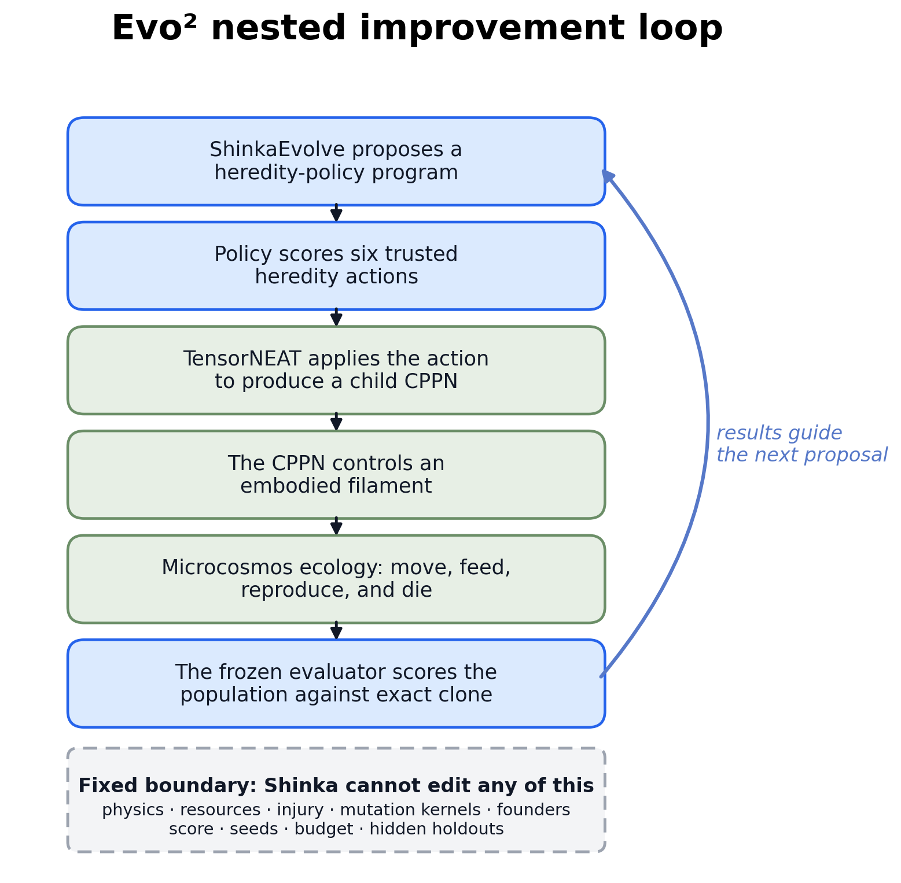
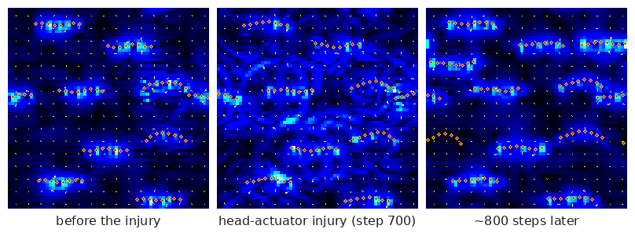
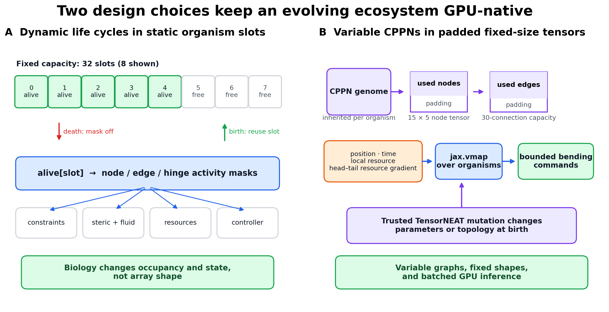
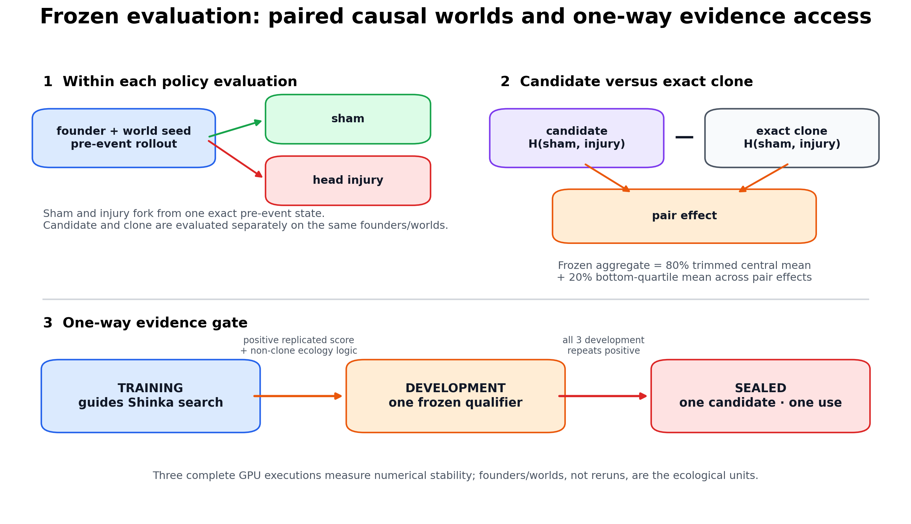
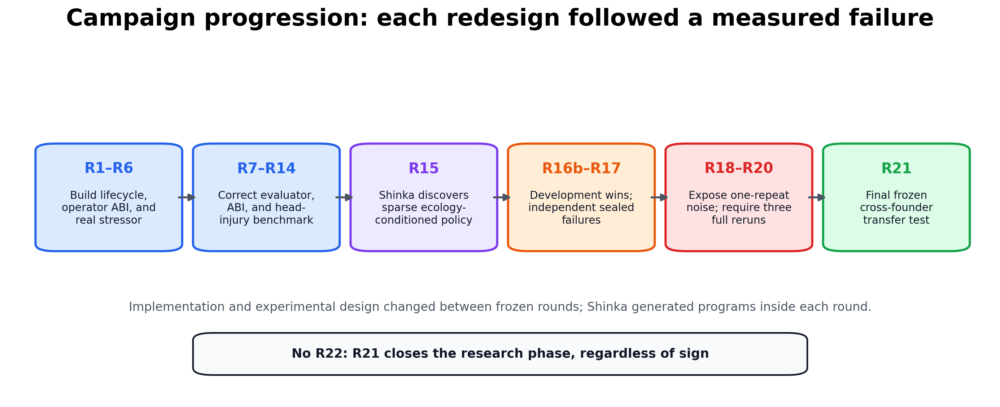
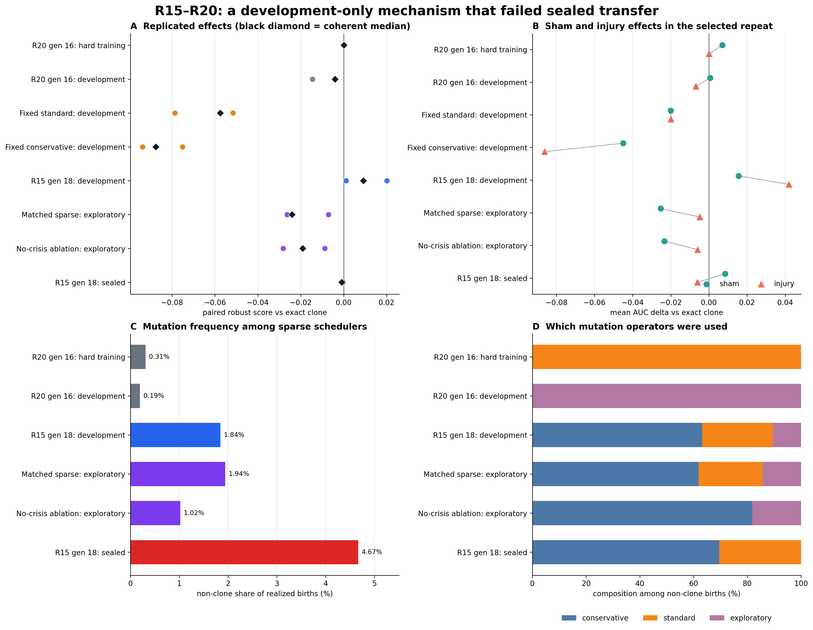
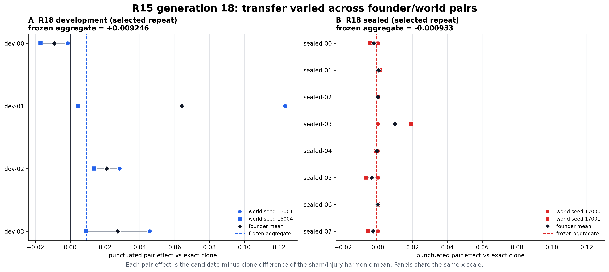
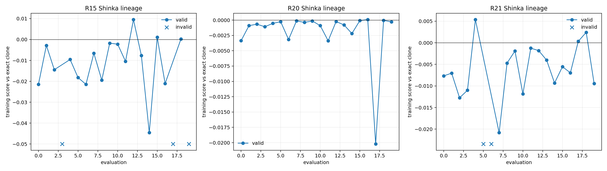
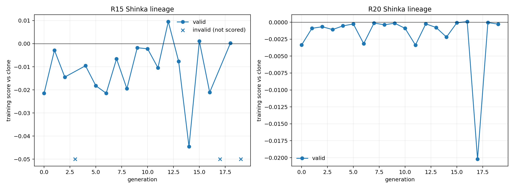

# Sakana AI Project

**Candidate:** Mark Moussa
**Project:** Evo²-Ecosystem: Recursive Discovery of Heredity Policies for Embodied Artificial Life
**Final status:** Complete through the preregistered R21 stopping boundary. R21 finished all 20 evaluations; its only 3/3-positive training qualifier failed all three new-development repeats, so the sealed founders remained unopened and no further search round was launched.

## At a glance

**What I built.** Evo²-Ecosystem is a GPU-native artificial-life system built on Microcosmos. Embodied filament organisms forage, spend energy, reproduce, inherit variable-topology CPPN controllers, mutate, and die. An outer ShinkaEvolve loop generates a small *heredity policy* that decides which trusted TensorNEAT operator should produce each child. Within every frozen round, Shinka can edit only that policy; physics, resources, mutation kernels, founders, scoring, and evidence partitions remain fixed.

**What happened.** Shinka autonomously discovered a sparse, ecology-conditioned scheduler that later beat exact cloning on all three executions over the R18 development panel. The source had never been generated or tuned on those founders, but the panel itself had already been opened during R20 diagnostics, so this is exploratory selection evidence rather than an independent confirmation. Two post-sealed analyses on that same panel support the interpretation that state conditioning, not merely a comparable sparse mutation mixture, contributed to the effect. The frozen policy then lost on all three executions of a one-shot independent sealed panel. A final 20-evaluation R21 search broadened training to 16 exposed founders; its only fully replicated training qualifier also lost on all three new-development executions. The new sealed panel was therefore never opened. The result is neither “Shinka failed” nor “RSI solved”: it is autonomous discovery of a substantive executable mechanism, followed by clean measurements of where that mechanism stopped generalizing.

**Why it matters for RSI.** The evolved artifact governs how future adaptive descendants are generated, so the outer loop improves a component of an improvement process. The search is intentionally bounded and objectively verified. Each principal outer round used a fixed 20-evaluation proposal budget; all ecosystem simulation and evaluation ran on one local NVIDIA GPU, while the program proposals came from an external headless Codex model. The central lesson is that a proposed self-improvement is not established until it survives an evaluator the proposing system cannot alter.

## Preamble

### Why RSI

For this project, I wanted to focus on a project I was deeply interested in, and that had to do with Recursive Self Improvement (RSI). I deeply believe that RSI is the final frontier. This belief comes from what I have dubbed “the Hitchhiker’s Guide to the Galaxy Index,” which is the phenomena that Hitchhiker’s Guide to the Galaxy has predicted societal and technological progression around us. It has certainly dictated much of my life without me realizing it at the moment. It imbued my love for space, and resulted in my ending up at NASA for a large chunk of my career. It also gave way to my love for AI, with characters such as Deep Thought and Eddie the Computer within them.

But throughout my life, I think the thing that impacted me the most from the books leads directly to RSI. It stems from the famous quote from the book (that most people do not know comes from this series), (paraphrased) “what is the answer to life, the universe, and everything?” to which Deep Thought, the AI, responds, “42.” This is seen as funny in the public eye. But what most don’t realize is what comes after in the book. Those who asked the question are frustrated by the seemingly meaningless answer, to which Deep Thought replies that the answer is meaningless because they never actually knew what the Ultimate Question was in the first place. This is at the crux of why I believe RSI is the final frontier, and the most important problem today to be working on.

While RSI may seem like another stepping stone in AI progression, I believe it represents a fundamental inflection point. Since the digital age has begun, the most profound and societally impactful innovations have focused on closing the gap in time and effort between the human and the answer. We went from needing to go to libraries to answer our questions, to being able to ask our questions to Google, and now to asking an LLM/VLM. See the pattern? All technological innovations are still predicated on the humans asking the questions, and the technology providing the answers. RSI is the first and last step in seeking to teach technology to ask the right questions in the first place. It goes even beyond sci-fi’s interpretation of what an advanced society will be.

To be clear, I actually believe this is one of the hardest problems to solve. It spans not only technological innovation, but also demands deep philosophical thought. What provokes creativity in humanity? How does one manufacture this? Is it even possible? But there are certain problems in life that are improvements in a depth-wise fashion: a pharmaceutical drug that shows to resolve non-Hodgkins lymphoma with high statistical significance, an innovative insight into a new type of exoplanet, or a breakthrough in materials science that finally achieves stable, room-temperature superconductivity. But there are also what I call “meta-problems,” or problems that create improvements in a breadth-wise fashion: the creation of a programmable gene-editing platform like CRISPR that provides a foundational mechanism to address thousands of disparate biological conditions, the development of a novel computing architecture that exponentially accelerates simulation times across all fields of chemistry and physics, or the achievement of recursive self-improvement in AI, establishing an autonomous engine capable of accelerating discovery across every conceivable cognitive domain. The breadth-wise discoveries are the ones that give way to an infinite amount of depth-wise problems, and if I want to set out what my goal has always been, to maximize positive impact on my fellow human, then it is decidedly what I want to dedicate my life to.

### Why I picked this project

My interests have always lived at the intersection of space, artificial intelligence, and the question of what life fundamentally is. My work at NASA led me toward astrobiology and origins-of-life research: not merely searching for Earth-like biology elsewhere, but asking what other forms an adaptive, persistent, evolving system might take. Artificial-life research, Microcosmos, and Sara Imari Walker's writing pushed me to think more seriously about life as a process for accumulating, preserving, and generating information.

Microcosmos was a compelling substrate because its organisms must work inside a viscous-fluid simulation rather than a symbolic benchmark or an LLM judge. It is JAX-based, GPU-native, visually interpretable, and physically grounded. It did not, however, contain the lifecycle needed for continuing population evolution: finite resources, stored energy, birth, death, inherited controllers, or phylogenetic lineages. Adding those capabilities created a world in which an evolutionary method could be judged through physical and ecological consequences.

The key decision was to move the optimization target up one level. A conventional evolutionary experiment improves organisms while heredity stays fixed. In Evo², the inner process evolves inherited CPPNs as organisms feed, reproduce, mutate, and die. The outer process uses ShinkaEvolve to write the policy deciding when offspring should be cloned or changed by one of five trusted mutation strategies. Its output is not one impressive swimmer; it is an executable hypothesis about how future generations should be produced.

This is not an origins-of-life simulation. Bodies are predefined filaments, and there is no spontaneous self-assembly or abiogenesis. The narrower question is still fundamental:

> **Can an autonomous system improve the rules by which embodied evolutionary variation is generated?**

### How it connects to Sakana's research

| Sakana work | Load-bearing connection in Evo² |
|---|---|
| **The AI Scientist v1/v2** | Automated experiments require explicit hypotheses, executable evaluation, reproducible evidence, and the willingness to preserve a negative result. |
| **ShinkaEvolve** | The outer engine evolves bounded executable heredity programs against an objective verifier under a fixed proposal budget. |
| **Darwin Gödel Machine** | Code descendants and their lineages are first-class artifacts, and the changed artifact is part of a future improvement process. Evo² fixes the proposer, verifier, and substrate to make attribution possible. |
| **Digital Red Queen** | The task asks how an improvement rule behaves under changing selection pressure. Here the change is a frozen physical injury rather than a coevolving adversary. |
| **Microcosmos** | The embodied GPU-native substrate makes the task Physical AI in simulation rather than prose evaluation or a purely symbolic benchmark. |

## Research question, scope, and RSI boundary

The research question is:

> **Can a Shinka-generated, ecology-conditioned heredity policy help populations of embodied artificial organisms outperform exact cloning and conventional mutation across changing and previously unseen founder populations?**

The complete system has three nested levels:



*Figure 1: ShinkaEvolve proposes a heredity-policy program; that program schedules trusted TensorNEAT variation at organism births; inherited CPPNs control bodies in Microcosmos; physical ecology determines which descendants reproduce. The frozen evaluator compares the resulting process with exact cloning.*

In one sentence:

> **Shinka evolves a policy that schedules TensorNEAT mutation; TensorNEAT changes CPPNs; CPPNs control organisms; Microcosmos ecology selects their descendants.**

| Evolvable inside a frozen round | Immutable inside that round |
|---|---|
| One JAX-compatible `make_offspring` function returning six operator logits | Microcosmos physics, resource and energy rules, birth/death accounting, CPPN representation, and trusted mutation kernels |
| Conditional logic over bounded parent, population, and delayed operator-evidence summaries | Founders, world seeds, injury, 12,000-step budget, exact-clone comparator, score, repeat procedure, and evidence partitions |
| Program source and its archive lineage | No raw genome tensors, scenario/founder/seed identity, future event information, hidden partition, score internals, filesystem, network, or subprocess access |

The project separates three related processes that are easy to conflate:

| Process | What changes | Agent of change |
|---|---|---|
| **Ordinary evolutionary optimization** | Organism CPPNs | Trusted variation plus ecological selection |
| **Bounded recursive program improvement** | The policy governing future heredity operations | ShinkaEvolve using a headless Codex proposal model |
| **Automated research orchestration** | Experimental designs between prospectively frozen rounds, execution, diagnosis, and preservation | An interactive Codex research agent under my direction and review |

The RSI claim is intentionally bounded. Shinka changes a component that generates future adaptive variation, but cannot rewrite its own proposer, evaluator, simulator, editable boundary, or tools. This is stronger than ordinary organism evolution and much narrower than unrestricted recursive self-modification.

## System architecture and key engineering decisions

### Embodied ecology and lifecycle

Each organism is an elastic eight-node filament in a two-dimensional viscous-fluid world. A padded CPPN maps body position, time, local resource, and the resource difference sensed between head and tail to bounded bending commands. Movement and living cost energy. A contention-safe resource field regenerates around localized patches; a mouth node consumes from it without allowing simultaneous consumers to remove more than is present.

An organism that earns enough energy can reproduce. The parent pays an immutable cost, the child receives a fixed endowment and inherited CPPN, and reproduction cannot create energy. Organisms die when energy is exhausted or their maximum age is reached. The simulator records unique IDs, parent IDs, generations, founder lineages, birth/death events, operator use, and delayed operator outcomes.



*Figure 2: Real frames from a shortened visualization-only rollout. Orange/yellow filaments are organisms and blue shows their fluid disturbance. For visual compactness this demo applies injury at step 700; every reported R15–R21 experiment instead uses the frozen 12,000-step protocol with injury at step 4,000.*

Selection is ecological and asynchronous. There is no second synchronous NEAT population manager, no generation-wide replacement, and no speciation layer. Successful controllers tend to earn births; harmful controllers tend to disappear. TensorNEAT supplies the trusted parametric and structural variation applied at those births.

### Dynamic biology with static GPU shapes

Birth and death normally suggest dynamically sized arrays, but JAX/XLA works best with static shapes. The implementation preallocates 32 organism slots, each containing storage for an eight-node body, genome, energy, age, identity, and lineage. A slot is storage, not necessarily a living organism. Death clears an `alive` mask; birth initializes an inactive slot. No array changes size.

Activity masks propagate through nodes, edges, bending constraints, steric deposition, immersed-boundary fluid coupling, resource uptake, control, energy, and metrics. An inactive body therefore remains in memory but has no physical or ecological effect. Long simulations execute in JIT-compiled `lax.scan` chunks and retain compact statistics rather than complete trajectories.

### Genuine CPPN/TensorNEAT heredity without a duplicate optimizer

Each organism carries a variable-topology CPPN in fixed-capacity tensors: at most 15 nodes and 30 connections, with unused rows padded. The same network is queried at every body hinge, so compact inherited graphs naturally generate coordinated spatial and temporal patterns. `jax.vmap` batches inference across organisms.

At birth, trusted operators can change weights, biases, activations, connections, or graph nodes. Every child graph is canonicalized, transformed into an execution plan, and validated for shapes, endpoints, duplicate edges, topology, and finite bounded parameters. Invalid children fall back safely to the parent. This keeps authentic CPPN-NEAT-style parameter and topology variation in the workflow without copying an unrelated NEAT selection system into the ecology.



*Figure 3: Two static-shape designs make dynamic evolution practical on GPU: lifecycle state changes occupancy masks rather than storage shape, and variable CPPN graphs occupy padded fixed-capacity tensors evaluated in batches.*

### A bounded but expressive heredity policy

The Shinka-generated function receives only normalized summaries:

| Input | Shape | Meaning |
|---|---:|---|
| `parent_genome_summary` | `(2,)` | Fractions of available CPPN node and connection capacity in use |
| `parent_stats` | `(3,)` | Parent energy, recent intake, and age |
| `population_stats` | `(6,)` | Alive fraction, mean energy, population change, birth rate, death rate, and mean intake |
| `operator_stats` | `(3, 6)` | Delayed success, usage, and evidence for each trusted action |
| `rng` | opaque scalar | ABI compatibility only; candidate validation forbids reading it |

It returns six finite `float32` logits over:

1. exact clone;
2. conservative parametric mutation;
3. standard parametric mutation;
4. exploratory parametric mutation;
5. structural mutation;
6. mixed parametric and structural mutation.

Trusted code owns random selection and mutation. The candidate never receives the raw genome or mutation key. Source is limited to a small JAX-compatible expression language and validated by an AST allowlist, immutable imports/regions, eager execution, JIT, `vmap`, shape/type/finiteness checks, deterministic repeated inputs, and a runtime limit. This boundary is large enough to express conditional algorithms but narrow enough that a higher score cannot come from weakening the world or editing the test.

### GPU-native, not end-to-end differentiable

The population state, resource field, CPPN inference, and rollout chunks are JAX PyTrees executed with `jit`, `vmap`, and `lax.scan`. Continuous filament/fluid dynamics and CPPN forward computation remain differentiable between lifecycle events. Birth, death, masks, parent/free-slot selection, categorical operator choice, injury, and topology mutation are discrete; Shinka's outer search is black-box. The accurate description is therefore:

> **A JAX/GPU-native evolving ecosystem built on Microcosmos's differentiable physical substrate.**

### Technical stack

| Component | Technology and role |
|---|---|
| Physical substrate | Microcosmos: elastic filaments, viscous fluid, steric interaction, and resource fields |
| Accelerator layer | JAX/XLA on one NVIDIA GPU: static-shape physics, ecology, batched CPPNs, and rollout chunks |
| Controller and genome | CPPN in padded TensorNEAT-compatible graph tensors |
| Inner evolutionary process | Food-earned asynchronous birth/death plus trusted parameter/topology variation |
| Outer program evolution | ShinkaEvolve with `headless/codex@gpt-5.5?effort=high` proposals |
| Verifier and isolation | Paired Python/JAX evaluation, exact-clone comparator, AST boundary, immutable manifests, and process limits |
| Analysis | NumPy, Pandas, and Matplotlib with repeat-, founder-, treatment-, operator-, and lineage-level evidence |
| Provenance | Content hashes, append-only result artifacts, program-parent records, and frozen per-round commits |

## Experimental design and immutable verification

### Paired sham and injury worlds

In this report, a **founder** is one frozen, validated CPPN genotype, not one initial organism. At episode reset, that CPPN is broadcast across all 32 fixed genome slots; the first eight slots are alive, receive distinct lineage IDs, and begin with the same genotype. The world seed independently controls body placement and simulation randomness. Cross-founder evaluation therefore changes the inherited starting controller, while multiple world seeds test different ecological realizations of it.

The primary disturbance is a persistent head-actuator injury: at step 4,000, the first two actuator gains fall from `1.0` to `0.1`; the other four stay at `1.0`. Each policy evaluation starts from a founder/world-seed state and forks an exact pre-event copy into sham and injury continuations. Candidate and exact clone are evaluated separately on the same founders and seeds; they are not assumed to share a trajectory with each other before the event.

For founder/world pair `i`, let `H(a,b) = 2ab/(a+b)` be the harmonic mean of sham and injury productivity. With `C` denoting the candidate and `A` exact clone, the pair effect is:

`d_i = H(C_i,sham, C_i,injury) − H(A_i,sham, A_i,injury)`

After sorting pair effects, the frozen robust score is:

`J = 0.8 × mean(25%-trimmed central effects) + 0.2 × mean(bottom-quartile effects)`

This rewards a policy that works across both physical regimes and explicitly penalizes founder-tail failure.

### Evidence partitions and numerical repeats



*Figure 4: Sham/injury pairing isolates the event within each policy evaluation. Evidence then moves in one direction: training guides search; a frozen training qualifier may enter development; only a 3/3-positive development source may enter the one-shot sealed panel.*

| Partition | Use |
|---|---|
| **Training** | Guides Shinka proposals and archive selection inside a frozen outer run |
| **Development** | Tests a frozen training-qualified source on previously unopened founders |
| **Sealed** | One independent evaluation for one fully qualified source; never reused for tuning |
| **Exploratory analysis** | Interprets mechanisms on already-open non-sealed data; cannot upgrade confirmatory evidence |

Each complete candidate-manifest evaluation runs three times because GPU scatter/reduction operations are not bitwise deterministic and the effects can be small. The evaluator selects the coherent median-scoring *whole-manifest execution*. It never assembles favorable episodes from different runs. These three executions measure numerical stability; they are not three independent ecological experiments. Founders and world seeds are the ecological units, and the evidence contains one outer search per frozen round.

Founder files and manifests are content-addressed and hash-checked. Development and sealed bytes are protected by protocol-enforced filesystem permissions during outer search. Those controls provide auditable access separation, not cryptographic isolation from the machine owner.

### Campaign progression and division of labor



*Figure 5: The compact history. Between rounds, measured failures motivated prospective experimental changes; within each round, Shinka autonomously generated the heredity programs against the already-frozen design.*

Codex and ShinkaEvolve served different roles. The interactive Codex research agent helped me implement the system, diagnose concrete failures, freeze revised protocols prospectively, operate long-running GPU jobs, and preserve artifacts. ShinkaEvolve, using its headless Codex proposer, generated the candidate heredity-policy programs within each frozen search. Microcosmos supplied the embodied world, TensorNEAT supplied trusted variation, and the verifier decided whether a program transferred. The full round-by-round history appears in Appendix A.

## Results

### The discovered R15 mechanism

The strongest completed pre-R21 artifact is the frozen R15 generation-18 program. Shinka autonomously wrote a clone-dominant scheduler containing interpretable computations for:

- **calm:** high occupancy, low deaths, stable population, and healthy energy;
- **pressure:** decline, deaths, energy/intake deficits, birth deficit, and low occupancy;
- **rescue:** interactions between low intake and other ecological stress;
- **operator value:** delayed success, usage, evidence, and scarcity;
- **parent quality and graph compactness:** bounded parent energy/intake and CPPN capacity use.

These signals alter a strong clone prior. The program does not receive the injury label and does not continuously mutate every child. It uses observable ecological state and accumulated operator evidence to decide when variation may be worth its cost. The complete central source is reproduced in Appendix E; its SHA-256 is `fc69ac96baa846b7650e474995566228582545b915ddf8dbd4754d161d573526`.

On four R18 development founders that had not generated or tuned the frozen R15 source, all three complete executions beat exact clone: `+0.001106`, `+0.020162`, and `+0.009246`. However, R20 generation 16 had already opened this panel before the R15 diagnostic, so the result is exploratory rather than an untouched confirmation. The coherent robust score was `+0.009246`; the selected execution had sham effect `+0.015556` and injury effect `+0.041902`. Realized births were 98.157% clone, 1.164% conservative mutation, 0.485% standard mutation, and 0.194% exploratory mutation.

### Development evidence, exploratory mechanism analyses, and sealed failure



*Figure 6: Completed R15–R20 evidence. Panel A shows all three numerical executions and the coherent selected result. Panel B separates sham and injury effects in the selected execution. Panels C–D show how often sparse schedulers mutated and which operators they used. Fixed standard/conservative are omitted from C–D because they mutate 100% of births by definition.*

| Policy | Evidence | Robust score | Positive executions | Interpretation |
|---|---|---:|---:|---|
| **R15 generation 18** | R18 development, exploratory selection | **+0.009246** | **3/3** | Replicated advantage on an already-open panel |
| Matched sparse | Same development panel, post-sealed exploratory | −0.024064 | 0/3 | A configured matched-mixture baseline did not reproduce the gain |
| No-crisis ablation | Same development panel, post-sealed exploratory | −0.019043 | 0/3 | Removing pressure/rescue terms removed the gain on this panel |
| **R15 generation 18** | **One-shot R18 sealed** | **−0.000933** | **0/3** | **Independent transfer failed** |

The two exploratory analyses support a narrow interpretation: ecology-conditioned code contributed on the development panel. The matched-sparse policy was configured from the R15 development mixture, although its realized non-clone share was 1.943% versus R15's 1.843%. Both analyses were conducted after sealed evaluation on already-open development data, so neither is an independent confirmation.

The frozen R15 source received exactly one evaluation on eight independent R18 sealed founders. Every execution was negative: `−0.000933`, `−0.001146`, and `−0.000301`. The coherent result improved sham productivity by `+0.008478` but reduced injury productivity by `−0.006053`. Mutation also fired more often than during development: 95.335% clone, 3.245% conservative, and 1.420% standard.



*Figure 7: Selected-execution founder/world-pair effects for the same frozen R15 program. Development contains substantial heterogeneity and one large positive pair; sealed effects cluster around zero with mixed signs. Black diamonds are founder means, and dashed lines show the frozen lower-tail-aware aggregate rather than a simple founder mean.*

The sealed magnitude is small, but the sign is negative in all three executions. The correct conclusion is:

> **ShinkaEvolve discovered a substantive ecology-conditioned scheduler that outperformed clone in three executions on an already-open development panel and was not explained by two simple post hoc alternatives there, but it did not generalize to the independent sealed founders.**

### Final R21 cross-founder test

R21 is the final research round. Its sole method change was broader exposed training diversity: the outer search used all 16 non-sealed R18 founders. A separately generated 4/4/8 founder bank supplied fresh holdouts because the earlier sealed panel was retired. Its four training-labelled founders were used only to construct and smoke-test the new bank, while the active search used the 16 exposed R18 founders. The new bank's four development and eight sealed founders formed the confirmatory panels. The simulator, candidate ABI, six operators, exact-clone comparator, 12,000-step horizon, step-4,000 injury, robust score, and three-execution procedure remained unchanged.

The search completed all 20 evaluations in 29,736.88 seconds of wall time, with 19 generated proposals after the initial R15 source and $2.8492 in recorded proposal API cost. Eighteen candidate evaluations were valid and two were rejected. Generation 4 was the only candidate positive in all three training executions (`+0.009665`, `+0.005382`, `+0.002814`), and its program was a genuine non-clone, ecology-conditioned mechanism. Frozen confirmation on the four new development founders then failed all three executions (`−0.010517`, `−0.006197`, `−0.007712`). Its sham effect remained positive (`+0.018830`) while its injury effect was negative (`−0.022518`). Generations 17 and 18 later had slightly positive robust training aggregates, but each contained one negative execution and therefore failed the replicated promotion rule.



*Figure 8: Complete valid-candidate training scores for the three principal late searches. Crosses mark R21 candidates rejected before scoring. R21 generation 4 was the only 3/3-positive training qualifier; its subsequent development result was negative in all three executions.*

R21 therefore did not qualify for sealed evaluation. All eight R21 sealed founder files remain unopened and mode `000`. No second development candidate, second sealed attempt, R22, or post-result redesign followed. The final R21 conclusion is a negative cross-founder generalization result.

### What the results establish today

The completed evidence supports four conclusions:

1. A fixed-shape GPU-native Microcosmos ecosystem can support embodied birth, death, energy, inherited variable-topology CPPNs, structural mutation, injury, and phylogenetic telemetry end to end.
2. ShinkaEvolve can generate substantive executable heredity algorithms rather than cosmetic edits or hard-coded swimmers.
3. Exploratory evidence on the already-open R18 development panel, including two post-sealed mechanism analyses, supports the interpretation that the R15 policy's advantage there came from ecology-conditioned crisis logic rather than merely applying a comparable sparse mutation mixture.
4. That policy did not generalize to the independent R18 sealed founders, and R21's first replicated training qualifier did not transfer to its new development founders. The project has not established a generally superior heredity algorithm.

The complete R21 lineage reinforces rather than changes these statements: small positive training aggregates appeared, but only one candidate replicated across all three executions, and that candidate failed fresh development. The project is submission-worthy despite the negative transfer result because the verifier was designed to expose, preserve, and explain failure rather than hide it.

## Interpretation and limitations

The important scientific boundary is **mechanism discovery versus verified general improvement**. R15 shows that Shinka can write a meaningful conditional heredity algorithm and find a development-panel opportunity that simple constant mutation misses. The sealed data shows that the same observable stress logic can over-trigger mutation on other founder ecologies. A plausible algorithm and a local causal story are not enough to establish transfer.

The principal limitations are:

- **Model scope.** Resource uptake, stored energy, metabolism, and actuation cost create real selection inside a physical simulation, but they are abstractions rather than a chemically or thermodynamically complete model of life. Bodies are predefined filaments; the project does not model abiogenesis, self-assembly, or growth from free material.
- **Search space.** Shinka schedules six fixed trusted operators. It cannot invent mutation kernels, semantic modules, sexual recombination, parent selection, or arbitrary mutation magnitudes. That strengthens attribution and safety while limiting possible improvements.
- **Evidence scale.** The 12,000-step horizon may favor immediate conservatism over adaptations requiring many generations. Three executions measure GPU numerical stability, not independent ecological replication, and each round contains one outer Shinka search. Complete recovery trajectories were not retained in the frozen result artifacts; the confirmatory evidence uses integrated post-event productivity.
- **Generalization.** Founder/world heterogeneity dominates small aggregate effects. The R18 sealed result and R21 development failure directly show that replicated training or development gains can still be distribution-specific.
- **RSI scope.** The evolved code controls part of an improvement process but cannot rewrite its proposer, verifier, simulator, or tools. This is bounded recursive program improvement, not an unbounded self-modifying agent.

“Bounded” does not mean inauthentic. Any empirical improvement system needs objectives and a mechanism deciding which changes survive. Here, restricting authority is what makes the recursive relationship testable: the policy can change how future organisms vary, while the standard used to judge it remains outside its reach.

## Reflections and future outlook

The largest lesson I took from this project is that proposal generation is not the hardest part of recursive self-improvement. Verification is. Shinka produced plausible, executable, biologically interpretable policies. One had a three-execution advantage on a panel that had not produced the source, plus supporting exploratory mechanism evidence. If I had stopped there, I could have told a compelling positive story. The panel was already open, however, and the one-shot sealed result was negative. Together, those facts show why that story would have been premature.

This changed how I think about RSI. A system is not credibly improving itself merely because it changes an improvement algorithm or scores better on examples that guided its search. The change must survive fresh starts, independent conditions, competitive baselines, and an evaluator it cannot modify. The frozen verifier is not administrative scaffolding around RSI; it is part of the core technical problem.

The campaign also separates two kinds of autonomy. Codex helped orchestrate the research process across measured failures; Shinka generated the improvement programs inside frozen experiments. Future automated scientists will need both creative experimental orchestration and immutable verification without conflating who changed the question with who answered it.

The next scientific directions, after this frozen study, would be:

- module-aware and continuously tunable variation rather than six fixed actions;
- multiple independent outer searches, making outer-search variability measurable;
- longer horizons and common-garden ancestor/descendant assays;
- combined within-lifetime gradient adaptation and across-generation evolution;
- physically grounded growth, then eventually self-assembly;
- coevolving stress tests only after basic cross-founder transfer is independently demonstrated.

My broader conviction about RSI is unchanged, but the project made it more concrete. Teaching a system to propose its own improvement is only half the problem. The other half is constructing a world in which the system can discover that its own attractive idea was wrong.

## Reproducibility and final artifacts

The canonical human-readable report is this file. The machine-readable final
artifact set is
`ShinkaEvolve/examples/evo2_ecosystem/results/evo2-r15-r21-final-artifacts-20260717/`.
It contains the combined comparison tables, every R21 generation score,
repeat-level and treatment-level effects, realized operator allocations, the
complete program-parent graph, the R15/R20/R21 lineage plot, compute and cost
accounting, and a SHA-256 manifest covering 83 result, source, protocol, and
provenance files. The raw R21 run directory additionally preserves every
proposal source, edit, prompt, model response, validation failure, metric,
SQLite archive relationship, runtime, and cost record. R21 sealed founder bytes
are deliberately excluded from post-run hashing because they remain unread and
mode `000`; their pre-lock hashes are already pinned by the frozen bank record.

All Python commands use the shared `sakana` Conda environment. From the common
repository parent:

```bash
# Verify the interpreter and CUDA backend used for experiments.
conda run -n sakana python -c \
  "import os,sys; assert os.path.basename(sys.prefix)=='sakana'; print(sys.executable)"
conda run -n sakana python -c \
  "import jax; assert jax.default_backend()=='gpu'; print(jax.devices())"

# Run the complete regression suites on CPU to avoid cumulative GPU allocation.
cd microcosmos
conda run -n sakana env JAX_PLATFORMS=cpu pytest -q
cd ../ShinkaEvolve
conda run -n sakana env JAX_PLATFORMS=cpu pytest -q

# Rebuild the final tables, plots, lineage, cost record, and hashes.
conda run -n sakana env JAX_PLATFORMS=cpu python \
  examples/evo2_ecosystem/summarize_r15_r21_campaign.py \
  --output-dir \
  examples/evo2_ecosystem/results/evo2-r15-r21-final-artifacts-20260717

# Optional document export; these are report-only tools, not simulator deps.
cd ../microcosmos
conda run -n sakana python -m pip install python-docx html2docx
conda run -n sakana python docs/evo2/build_submission_docx.py \
  docs/evo2/sakana-ai-project-candidate-writeup.md \
  docs/evo2/sakana-submission.docx
```

The exact R21 launch command, model, hashes, source programs, manifests, and
commits are preserved in `launch.json` and `complete.json` inside
`evo2-final-r21-cross-founder-20260716/`. Re-running the outer search is
expected to generate different proposals and GPU-level numerical variation;
reproducibility here means preserving the exact executed evidence and making
the frozen evaluation procedure independently runnable, not claiming that an
LLM-driven stochastic search is bitwise repeatable.

## Appendix

### A. Complete campaign history

Round numbers are not perfectly contiguous because an actuator-injury subtrack ran alongside the early main series, and R7–R14 were rapid exploratory iterations. The table uses the actual documented labels and groups rounds that did not warrant standalone claims.

| Round | Prospective change | Outcome and decision |
|---|---|---|
| R1 | First four-operator scheduler search; calm versus disrupted training | Ran end to end but produced no reliable advantage. The scheduling logic, not the training label, was the real variable. |
| Actuator r1–r2 | Introduce persistent physical actuator injury and screen a new founder bank | No candidate passed the founder screen because one seed caused extinction before reproduction. No search was authorized; the bank was rebuilt. |
| Actuator r3 | Complete the injury search | Shinka rediscovered 100% parametric mutation, while the chosen *tail* injury helped controls by reducing movement cost. The benchmark was inverted, motivating head injury. |
| R4 | Replace the four-action design with six trusted operators and delayed reproductive credit | Established the action space and evidence interface retained by all later rounds. |
| R5 | World-feasibility screen | Stopped prospectively because the disturbance did not qualify as a real stressor. |
| R6 | Resource-relocation shock | Also stopped prospectively because relocation did not qualify. |
| R7–R14 | Repair imports/evaluator semantics, establish exact-clone comparison, correct the ABI, tune head injury, and remove non-safety proposal-size limits | Produced negative or non-transferable schedulers but earned the final bounded interface and head-injury benchmark. R14's best development policy still paid too much mutation cost. |
| R15 | Search from exact clone for sparse ecology-conditioned mutation | Shinka generated the generation-18 scheduler. Its original development panel was negative, but the source remained a useful frozen mechanism. |
| R16 | Move head injury from step 7,500 to step 4,000 | Measured the core tradeoff: continuous mutation helped injury but imposed a larger sham-world cost. A sparse policy nearly closed the gap. |
| R16b | Remove arbitrary source-depth limits while leaving capability/runtime restrictions intact | First 3/3-positive development source; failed its one sealed evaluation because of founder-tail sensitivity. |
| R17b | Broaden exposed training founders | Again passed 3/3 development and failed sealed transfer. |
| R18/R18b | Freeze a hard 4/4/8 founder bank and continue an interrupted search without changing the experiment | No promotable candidate. The same source changed score sign between one-repeat executions, exposing numerical variation. |
| R19 | Require three complete numerical executions per training candidate | No candidate beat clone; one-repeat positives were no longer admissible. |
| R20 | Reset to a compact stress scheduler while retaining replicated evaluation | A tiny replicated training positive failed all three development executions. Diagnostic baselines on the now-open development panel rediscovered R15 generation 18 as the only 3/3-positive opportunity. |
| R15-on-R18 analysis | Freeze R15 generation 18, run the already-open R18 development panel, then the one permitted R18 sealed test | Exploratory development selection: 3/3 positive. Matched-sparse and no-crisis analyses were negative on that open panel. Independent sealed: 0/3 positive. Panel retired. |
| R21 | Train on all 16 exposed non-sealed R18 founders; freeze a new independent 4/4/8 bank | Completed 20 evaluations. The only 3/3-positive training qualifier failed all three new-development executions; sealed stayed unopened. No further research round followed. |

Two unpublished R21 founder screens are part of the historical record. Panel seed `8007` and then seed `9007` with screening worlds `18000/18001` produced finite CPPNs but zero births. The final bank kept panel seed `9007` and changed only the viability-screen worlds to previously validated seeds `12000/12001`; all failed attempts were retained rather than overwritten.

### B. Complete R15–R21 numerical results

“Robust score” is the frozen lower-tail-aware candidate-minus-clone aggregate. Sham/injury columns are mean candidate-minus-clone AUC deltas for the coherent selected execution. Operator fractions are also from that execution.

**Table B1: Scores and treatment effects**

| Candidate | Partition | Robust | Three complete execution scores |
|---|---|---:|---|
| R20 gen 16 | Hard training | +0.000095 | +0.000095; −0.000227; +0.000118 |
| R20 gen 16 | R18 development | −0.004069 | −0.004069; −0.014493; −0.003984 |
| Fixed standard | R18 development | −0.057539 | −0.057539; −0.051515; −0.078614 |
| Fixed conservative | R18 development | −0.087536 | −0.087536; −0.093678; −0.075106 |
| **R15 gen 18** | **R18 development, exploratory** | **+0.009246** | **+0.001106; +0.020162; +0.009246** |
| Matched sparse | Development, exploratory | −0.024064 | −0.024064; −0.026399; −0.007038 |
| No-crisis ablation | Development, exploratory | −0.019043 | −0.019043; −0.028174; −0.008733 |
| **R15 gen 18** | **R18 sealed** | **−0.000933** | **−0.000933; −0.001146; −0.000301** |
| **R21 gen 4** | **R21 training** | **+0.005382** | **+0.009665; +0.005382; +0.002814** |
| **R21 gen 4** | **R21 development** | **−0.007712** | **−0.010517; −0.006197; −0.007712** |

**Table B2: Sham and injury effects in the selected execution**

| Candidate | Partition | Sham | Injury |
|---|---|---:|---:|
| R20 gen 16 | Hard training | +0.007004 | +0.000110 |
| R20 gen 16 | R18 development | +0.000646 | −0.006874 |
| Fixed standard | R18 development | −0.020112 | −0.019942 |
| Fixed conservative | R18 development | −0.044942 | −0.086182 |
| **R15 gen 18** | **R18 development, exploratory** | **+0.015556** | **+0.041902** |
| Matched sparse | Development, exploratory | −0.025339 | −0.004810 |
| No-crisis ablation | Development, exploratory | −0.023406 | −0.005925 |
| **R15 gen 18** | **R18 sealed** | **+0.008478** | **−0.006053** |
| **R21 gen 4** | **R21 training** | **+0.007798** | **+0.016683** |
| **R21 gen 4** | **R21 development** | **+0.018830** | **−0.022518** |

**Table B3: Realized heredity allocation in the selected execution**

| Candidate | Partition | Clone | Conservative | Standard | Exploratory |
|---|---|---:|---:|---:|---:|
| R20 gen 16 | Hard training | 99.690% | 0.000% | 0.310% | 0.000% |
| R20 gen 16 | R18 development | 99.805% | 0.000% | 0.000% | 0.195% |
| Fixed standard | R18 development | 0.000% | 0.000% | 100.000% | 0.000% |
| Fixed conservative | R18 development | 0.000% | 100.000% | 0.000% | 0.000% |
| **R15 gen 18** | **R18 development, exploratory** | **98.157%** | **1.164%** | **0.485%** | **0.194%** |
| Matched sparse | Development, exploratory | 98.057% | 1.205% | 0.463% | 0.275% |
| No-crisis ablation | Development, exploratory | 98.980% | 0.834% | 0.000% | 0.186% |
| **R15 gen 18** | **R18 sealed** | **95.335%** | **3.245%** | **1.420%** | **0.000%** |
| **R21 gen 4** | **R21 training** | **97.297%** | **1.824%** | **0.878%** | **0.000%** |
| **R21 gen 4** | **R21 development** | **98.496%** | **1.378%** | **0.125%** | **0.000%** |

Structural and mixed mutation were exactly zero in these selected executions. The fixed policies use their named operator for every realized birth.

### C. Program-evolution lineage



*Figure A1: Training scores for every R15 and R20 program generation. Invalid R15 proposals were rejected before ecosystem evaluation; R20's compact bounded sources all reached simulation. A training peak is only an archive event, not evidence of transfer: the corresponding frozen source still had to pass development and sealed rules.*

The lineage artifacts preserve each candidate's source, parent source, edit, prompt, model response, validation outcome, score, and cost. The graph above is shown to demonstrate that Shinka searched a lineage of executable programs, not merely scalar hyperparameters.

### D. Frozen configuration, integrity, and compute accounting

#### Core evaluation configuration

| Item | Frozen value |
|---|---|
| Body and population | 8 nodes per filament; 32 preallocated organism slots |
| Episode initialization | One validated CPPN founder broadcast to all slots; first 8 slots alive with distinct lineage IDs |
| CPPN capacity | 15 nodes; 30 connections; padded fixed-shape tensors |
| Controller inputs | Body coordinate, time phase, local resource, head–tail resource gradient |
| Trusted heredity actions | Clone, conservative, standard, exploratory, structural, mixed |
| Evaluation horizon | 12,000 simulator steps in 500-step chunks |
| Physical event | Head-actuator injury at step 4,000; actuator gains `[0.1, 0.1, 1, 1, 1, 1]` |
| Comparator | Exact clone, source SHA-256 prefix `a1c8014508aa` (full hash below) |
| Candidate evaluation | Three complete full-manifest GPU executions; coherent median execution selected |
| Outer proposer | `headless/codex@gpt-5.5?effort=high` through ShinkaEvolve |
| Principal outer budget | 20 evaluated generation slots per frozen main round |
| Hardware | One NVIDIA GB10 host with 119 GiB unified memory; each JAX job guarded at 20/24 GiB memory high/max |
| Software environment | Linux; Conda environment `sakana`; CUDA 13-enabled JAX/XLA |

**Trusted heredity action registry.** The numerical columns are the immutable TensorNEAT profile supplied to trusted mutation code. Connection and node rates apply independently to add and delete operations.

| Action | Value rate / power | Replace rate | Activation rate | Connection add/delete | Node add/delete |
|---|---:|---:|---:|---:|---:|
| Exact clone | 0 / 0 | 0 | 0 | 0 | 0 |
| Conservative parametric | 0.10 / 0.075 | 0.0075 | 0.05 | 0 | 0 |
| Standard parametric | 0.20 / 0.15 | 0.015 | 0.10 | 0 | 0 |
| Exploratory parametric | 0.40 / 0.30 | 0.03 | 0.20 | 0 | 0 |
| Structural | 0 / 0 | 0 | 0 | 0.20 | 0.10 |
| Mixed | 0.20 / 0.15 | 0.015 | 0.10 | 0.20 | 0.10 |

**Frozen ecology constants.** Child endowment is `reproduction cost × transfer efficiency = 1.2` energy units.

| Quantity | Frozen value | Quantity | Frozen value |
|---|---:|---|---:|
| Grid / time step | 64 × 64 / 0.01 | Initial / maximum population | 8 / 32 |
| Body / bend limit | 8 nodes / 0.35 radians per step | Initial organism energy | 2.0 |
| Reproduction threshold / cost | 3.0 / 1.5 | Birth-transfer efficiency | 0.8 |
| Child endowment | 1.2 | Maturity age | 50 steps |
| Maximum lifespan | 5,000 steps | Basal metabolism | 0.01 |
| Actuation-power coefficient | 0.002 | Uptake rate | 1.0 |
| Assimilation efficiency | 0.9 | Resource capacity / initial stock | 1.0 / 1.0 |
| Regeneration rate / diffusion | 0.03 / 0.0 | Resource patch center / radius | (48, 32) / 12 |

**Exploratory control definitions.** Matched sparse ignored all ecological and operator evidence and returned the constant action probabilities `[0.9815712900096993, 0.011639185257032008, 0.004849660523763337, 0.0019398642095053346, 1e-8, 1e-8]`, configured from R15's selected development execution. Sampling made its realized non-clone rate slightly different from R15's. The no-crisis ablation retained the frozen R15 base logits, calm term, and delayed success/usage/evidence terms, but deleted only `pressure_gain × pressure` and `rescue_gain × rescue` from the final logits.

#### R21 frozen provenance

| Artifact | SHA-256 prefix / value |
|---|---|
| Exact-clone program | `a1c8014508aa` |
| Initial R15 generation-18 program | `fc69ac96baa8` |
| Active 16-founder training index | `ac99bf29a875` |
| Active 32-world training manifest | `7bd346ae94f4` |
| Independent 4/4/8 founder-bank index | `2f859dadf096` |
| New development manifest | `127a5138e240` |
| New sealed manifest | `7f824a8cf0c9` |
| Microcosmos search-boundary commit | `270961a570f8` |
| ShinkaEvolve search-boundary commit | `2d83c53c5598` |

Full frozen identifiers:

```text
exact_clone_sha256 = a1c8014508aaebcb355f41b374f1d258a837f4a09ea0ad07b0c6d2df46a4ffe3
r15_gen18_sha256 = fc69ac96baa846b7650e474995566228582545b915ddf8dbd4754d161d573526
r21_training_index_sha256 = ac99bf29a87597e2a9fc7db62445ab338944f88742f9992cbd86ca73353758b9
r21_training_manifest_sha256 = 7bd346ae94f4e184057672c2c63988965390ae2a04ecf0d045af817287152041
r21_independent_bank_sha256 = 2f859dadf096cfb9dd5d3bb3a251a9dfaf91ff2546364ba14f2eafc48e11dd23
r21_development_manifest_sha256 = 127a5138e240d11b5643ee8d64063283c3a15c9fcb4f301d3a686b2a673c5d80
r21_sealed_manifest_sha256 = 7f824a8cf0c9ff2ca8b284a19dcf309237498e9df1400f548b2da7da0a7bc434
microcosmos_commit = 270961a570f81d6f73b3b98c68a80af14ec7b469
shinkaevolve_commit = 2d83c53c5598cd1a5ccf8e4dd0ec17fb685baa7b
```

R21's four development and eight sealed founder bytes were mode `000` during outer search. Only development was made readable for the frozen generation-4 confirmation; sealed remained mode `000`. This is auditable protocol enforcement, not cryptographic protection against a machine administrator.

#### Recorded principal-search runtime and model API cost

| Run | Evaluations | Wall time | Recorded proposal API cost |
|---|---:|---:|---:|
| R15 | 20 | 8,425.48 s | $2.6885 |
| R16 | 20 nominal | 4,592.08 s | $2.8186 |
| R16b | 20 | 13,563.72 s | $3.1051 |
| R17b | 20 | 16,730.60 s | $3.2743 |
| R18 interrupted portion | Through generation 13 | Not finalized | $2.4925 |
| R18b continuation | 7 | 2,181.69 s | $1.0015 |
| R19 | 20 | 13,060.27 s | $3.6230 |
| R20 | 20 | 16,090.78 s | $2.8753 |
| **Recorded R15–R20 proposal total** | Not applicable | Not applicable | **$21.8788** |
| R21 | 20 | 29,736.88 s | $2.8492 |
| **Recorded R15–R21 proposal total** | Not applicable | Not applicable | **$24.7280** |

R21's final CLI additionally reported 8h 27m 19s of total compute accounting. Wall time is elapsed service time and includes differing contention conditions; it is not normalized GPU compute. The table covers principal Shinka searches, not every founder screen, fixed baseline, confirmation, failed startup, analysis, or report-generation process. API cost is for external program proposals, not local simulation.

### E. Selected implementation excerpts

The repository will not accompany this report, so the excerpts below reproduce the implementation seams needed to understand the design. Boilerplate and unrelated validation branches are omitted only where noted.

#### E1. Fixed-capacity lifecycle and slot reuse

The ecosystem chooses eligible parents and inactive child slots entirely in fixed-size JAX arrays. Birth changes state in an existing slot rather than appending storage.

```python
# src/microcosmos/ecology.py: selection of parent and reusable child slots
capacity = population.alive.shape[0]
slots = jnp.arange(capacity, dtype=jnp.int32)
eligible = (
    population.alive
    & (population.age >= lifecycle.maturity_age)
    & (population.energy >= lifecycle.reproduction_threshold)
    & (population.energy >= lifecycle.reproduction_cost)
)
free = ~population.alive

parent_order = jnp.argsort(
    jnp.where(eligible, -population.energy, jnp.inf), stable=True
).astype(jnp.int32)
child_order = jnp.argsort(
    jnp.where(free, slots, capacity), stable=True
).astype(jnp.int32)
birth_count = jnp.minimum(
    jnp.minimum(jnp.sum(eligible), jnp.sum(free)), max_births
).astype(jnp.int32)
valid = slots < birth_count
parent_slots = jnp.where(valid, parent_order, -1)
child_slots = jnp.where(valid, child_order, -1)
```

Death clears the `alive` mask. Static maps expand slot activity to nodes, edges, and bending hinges; the same mask gates constraints, steric/fluid coupling, resources, and control. Thus inactive bodies are allocated but physically absent.

#### E2. Batched fixed-capacity CPPN inference

Each organism receives the same shaped observation grid, and `vmap` evaluates its padded CPPN.

```python
# src/microcosmos/cppn.py: population-batched CPPN observations and inference
capacity = alive.shape[0]
if normalized_coordinate.shape[0] % capacity:
    raise ValueError("bending coordinates must divide evenly by capacity")

hinges_per_organism = normalized_coordinate.shape[0] // capacity
coordinate = normalized_coordinate.reshape(capacity, hinges_per_organism)
local = jnp.clip(local_resource, 0.0, 1.0).reshape(
    capacity, hinges_per_organism
)
phase = jnp.broadcast_to(
    jnp.asarray(physical_time, dtype=jnp.float32) * PHASE_RATE,
    coordinate.shape,
)
gradient = jnp.broadcast_to(
    jnp.clip(head_resource - tail_resource, -1.0, 1.0)[:, None],
    coordinate.shape,
)
observations = jnp.stack([coordinate, phase, local, gradient], axis=-1)

raw = jax.vmap(_forward_organism)(
    genome.node_genes,
    genome.connection_genes,
    controller_order,
    controller_connection_index,
    observations,
)
```

`MAX_NODES = 15` and `MAX_CONNECTIONS = 30`; unused rows use padding sentinels. The raw output is bounded and multiplied by slot activity before reaching the body.

#### E3. Editable policy versus trusted mutation

The editable ABI is deliberately small:

```python
# ShinkaEvolve initial_r4.py: the only function Shinka may rewrite
def make_offspring(
    parent_genome_summary,  # (2,)
    parent_stats,           # (3,)
    population_stats,       # (6,)
    operator_stats,         # (3, 6)
    rng,                    # opaque sentinel; reading is forbidden
):
    """Return logits for the six trusted heredity operators."""
    return jnp.array(
        [-8.0, -8.0, 8.0, -8.0, -8.0, -8.0],
        dtype=jnp.float32,
    )
```

Trusted Microcosmos code owns every genome transformation:

```python
# src/microcosmos/heredity.py: trusted six-operator dispatch
def clone(_):
    return parent

def conservative(_):
    return _profiled_parametric_mutation(
        parent, mutation_context, CONSERVATIVE_GENOME, CONSERVATIVE_STATE
    )

def standard(_):
    return _parametric_mutation(parent, mutation_context)

def exploratory(_):
    return _profiled_parametric_mutation(
        parent, mutation_context, EXPLORATORY_GENOME, EXPLORATORY_STATE
    )

def structural(_):
    return _structural_mutation(parent, mutation_context)

def mixed(_):
    return _mixed_mutation(parent, mutation_context)

child = jax.lax.switch(
    operator,
    (clone, conservative, standard, exploratory, structural, mixed),
    operand=None,
)
return R4OffspringResult(
    child, jnp.array(True), operator, probabilities
)
```

Malformed logits fall back to clone. Newborn graphs are separately validated, and a malformed transformed graph is replaced with the parent graph.

#### E4. The central autonomously generated artifact

This is the complete editable block for frozen R15 generation 18, reproduced without alteration. The program accepts only the bounded summaries above and returns six logits. SHA-256: `fc69ac96baa846b7650e474995566228582545b915ddf8dbd4754d161d573526`.

```python
def make_offspring(
    parent_genome_summary,
    parent_stats,
    population_stats,
    operator_stats,
    rng,
):
    """Vector-regime sparse heredity scheduler."""
    success = operator_stats[0]
    usage = operator_stats[1]
    evidence = operator_stats[2]
    node_fraction = parent_genome_summary[0]
    connection_fraction = parent_genome_summary[1]
    energy_fraction = parent_stats[0]
    intake_ema = parent_stats[1]
    alive_fraction = population_stats[0]
    mean_energy_fraction = population_stats[1]
    population_change_ema = population_stats[2]
    birth_rate_ema = population_stats[3]
    death_rate_ema = population_stats[4]
    mean_intake_ema = population_stats[5]
    decline = jnp.clip(-population_change_ema, 0.0, 1.0)
    growth = jnp.clip(population_change_ema, 0.0, 1.0)
    death = jnp.clip(death_rate_ema, 0.0, 1.0)
    birth_gap = jnp.clip(0.28 - birth_rate_ema, 0.0, 1.0)
    energy_gap = jnp.clip(0.56 - mean_energy_fraction, 0.0, 1.0)
    intake_gap = jnp.clip(0.54 - mean_intake_ema, 0.0, 1.0)
    parent_quality = jnp.clip(
        0.58 * energy_fraction + 0.42 * intake_ema, 0.0, 1.0
    )
    compact = jnp.clip(
        1.0 - 0.55 * node_fraction - 0.45 * connection_fraction,
        0.0,
        1.0,
    )
    calm = jnp.clip(
        alive_fraction
        * (1.0 - death)
        * (1.0 - decline)
        * (0.58 + 0.42 * mean_energy_fraction),
        0.0,
        1.0,
    )
    pressure = jnp.clip(
        0.78 * decline
        + 0.68 * death
        + 0.38 * energy_gap
        + 0.44 * intake_gap
        + 0.18 * birth_gap
        + 0.16 * (1.0 - alive_fraction),
        0.0,
        1.0,
    )
    rescue = jnp.clip(
        intake_gap * (0.52 * decline + 0.34 * death + 0.24 * energy_gap),
        0.0,
        1.0,
    )
    prior = jnp.array(
        [0.22, 0.56, 0.50, 0.40, 0.37, 0.39], dtype=jnp.float32
    )
    learned = jnp.clip(
        evidence * success + (1.0 - evidence) * prior, 0.0, 1.0
    )
    scarce = jnp.clip(1.0 - usage, 0.0, 1.0)
    evidence_gap = jnp.clip(1.0 - evidence, 0.0, 1.0)
    probe = evidence_gap * scarce
    op_value = (
        1.85 * learned + 0.38 * scarce + 0.14 * probe - 0.22 * usage
    )
    base = jnp.array(
        [4.34, -1.12, -2.04, -4.88, -5.58, -5.26], dtype=jnp.float32
    )
    calm_gain = jnp.array(
        [2.12, 0.62, 0.22, -0.24, -0.20, -0.18], dtype=jnp.float32
    )
    pressure_gain = jnp.array(
        [-2.34, 0.10, 1.18, 1.75, 1.42, 1.55], dtype=jnp.float32
    )
    rescue_gain = jnp.array(
        [-0.62, 0.52, 1.06, 1.42, 0.82, 1.04], dtype=jnp.float32
    )
    quality_gain = jnp.array(
        [0.00, 0.88, 0.44, 0.10, 0.00, 0.06], dtype=jnp.float32
    )
    shape_gain = jnp.array(
        [0.00, 0.00, 0.00, 0.12, 0.68, 0.20], dtype=jnp.float32
    )
    growth_gain = jnp.array(
        [0.08, 0.04, -0.10, -0.16, -0.10, 0.28], dtype=jnp.float32
    )
    value_gain = jnp.array(
        [0.46, 0.78, 0.92, 0.70, 0.68, 0.68], dtype=jnp.float32
    )
    logits = (
        base
        + calm_gain * calm
        + pressure_gain * pressure
        + rescue_gain * rescue
        + quality_gain * parent_quality
        + shape_gain * compact
        + growth_gain * growth
        + value_gain * op_value
    )
    return jnp.clip(logits, -7.0, 7.0)
```

The clone logit starts strongly positive. Calm further protects cloning, while pressure/rescue selectively raise mutation logits. Delayed operator evidence modulates every action. The program is therefore a state-conditioned scheduling algorithm, not a constant sparse mixture.

#### E5. Exact paired robust score

The verifier first computes a candidate-minus-clone harmonic-mean effect for each sham/injury pair, then combines central and lower-tail effects.

```python
# experiments/evo2_ecosystem/episode.py: paired score
for indices in grouped.values():
    null_index, shock_index = _resolve_pair_indices(manifest, indices)
    candidate_sham = float(candidate.episodes[null_index].primary_score)
    ancestor_sham = float(ancestor.episodes[null_index].primary_score)
    candidate_shock = float(candidate.episodes[shock_index].primary_score)
    ancestor_shock = float(ancestor.episodes[shock_index].primary_score)

    sham_deltas.append(candidate_sham - ancestor_sham)
    shock_deltas.append(candidate_shock - ancestor_shock)
    deltas.append(
        _harmonic_mean(candidate_sham, candidate_shock)
        - _harmonic_mean(ancestor_sham, ancestor_shock)
    )

values = np.sort(np.asarray(deltas, dtype=np.float64))
trim = int(np.floor(0.25 * len(values)))
central = values[trim : len(values) - trim]
lower = values[: max(1, int(np.ceil(0.25 * len(values))))]
score = 0.8 * float(np.mean(central)) + 0.2 * float(np.mean(lower))
```

#### E6. Training-only manifest binding

The outer evaluator loads the exact hash-bound manifest named by the frozen protocol and rejects a non-training partition.

```python
# ShinkaEvolve evaluate.py: immutable training binding
def _load_bound_manifest(spec, role, dependencies):
    """Load exactly the manifest named by the selected protocol."""
    if run_spec.schema_version(spec) == 1:
        if not role.startswith("training_"):
            raise ValueError("the evaluator may load only training manifests")
        return dependencies["load_training_manifest"](
            role.removeprefix("training_")
        )
    return dependencies["load_bound_manifest"](
        run_spec.manifest_path(spec, role),
        expected_sha256=run_spec.manifest_hash(spec, role),
        expected_partition="training",
    )
```

Promotion is a protocol decision outside candidate code: a positive replicated training score plus a real non-clone ecology-conditioned mechanism permits development; all three development executions must be positive before the one permitted sealed evaluation.

### F. Short project summary for the interview

> I built Evo²-Ecosystem, a GPU-native artificial-life benchmark in which an outer ShinkaEvolve loop modifies the heredity policy of an inner embodied evolutionary process. I extended Microcosmos with finite resources, energy, birth, death, inherited variable-topology CPPNs, TensorNEAT variation, physical injury, and lineage tracking. Shinka can edit only a bounded scheduler over six trusted heredity operators; physics, mutation kernels, founders, scoring, and holdouts remain frozen within each round. It discovered a sparse ecology-conditioned policy that beat exact cloning in three executions on an already-open development panel. Two post-sealed exploratory analyses support that its state conditioning mattered there. The same frozen policy then lost all three independent sealed executions, and the only fully replicated R21 cross-founder training qualifier also failed all three fresh-development executions. The contribution is therefore both a concrete embodied-RSI benchmark and an honest demonstration that autonomous mechanism discovery is not the same as verified general improvement.

### G. References

1. Lu, C., et al. “Towards End-to-End Automation of AI Research.” *Nature* 651, 914–919 (2026). [https://www.nature.com/articles/s41586-026-10265-5](https://www.nature.com/articles/s41586-026-10265-5)
2. Sakana AI. “The AI Scientist: Towards Fully Automated Open-Ended Scientific Discovery.” [https://sakana.ai/ai-scientist/](https://sakana.ai/ai-scientist/)
3. Sakana AI. “ShinkaEvolve: Evolving New Algorithms with LLMs, Orders of Magnitude More Efficiently.” [https://sakana.ai/shinka-evolve/](https://sakana.ai/shinka-evolve/)
4. Sakana AI. “The Darwin Gödel Machine: Open-Ended Evolution of Self-Improving Agents.” [https://sakana.ai/dgm/](https://sakana.ai/dgm/)
5. Sakana AI. “Digital Red Queen: Adversarial Program Evolution in Core War with LLMs.” [https://sakana.ai/drq/](https://sakana.ai/drq/)
6. Tensen, M., et al. “Microcosmos: Reimagining Artificial Life for the GPU Era.” arXiv:2607.02954 (2026). [https://arxiv.org/abs/2607.02954](https://arxiv.org/abs/2607.02954)
7. Stanley, K. O. “Compositional Pattern Producing Networks: A Novel Abstraction of Development.” *Genetic Programming and Evolvable Machines* 8, 131–162 (2007). [https://doi.org/10.1007/s10710-007-9028-8](https://doi.org/10.1007/s10710-007-9028-8)
8. Stanley, K. O., and Miikkulainen, R. “Evolving Neural Networks through Augmenting Topologies.” *Evolutionary Computation* 10(2), 99–127 (2002). [https://doi.org/10.1162/106365602320169811](https://doi.org/10.1162/106365602320169811)
9. Wang, L., Zhao, M., Liu, E., Sun, K., and Cheng, R. “TensorNEAT: A GPU-Accelerated Library for NeuroEvolution of Augmenting Topologies.” arXiv:2504.08339 (2025). [https://arxiv.org/abs/2504.08339](https://arxiv.org/abs/2504.08339)
